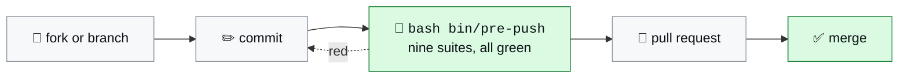

# Contributing to mentis

Two rules, and the second one is the unusual one. Read both before you open
anything.

## 1. Every change goes through a pull request

`main` is protected, for everyone **including the owner** (`enforce_admins` is on):
no direct push, no force push, no branch deletion, and the `gate` status check has
to be green.



**If you modify mentis, you open a pull request.** That is not only a project
convention — under the AGPL, a modified version you hand to anyone else, whether
by distributing it or by running it as a service for them, has to come with its
complete corresponding source under the same licence. Upstreaming it here is the
cheapest way to satisfy that, and the only way your change survives the next
version rather than becoming a fork you maintain alone.

A review isn't required to merge (there is no second maintainer reliably available
to give one), but **the PR itself, and the trail it leaves, is mandatory**.

### Before you open it

```bash
bash bin/pre-push
```

Nine suites, 216 checks. A red suite is a red PR — the gate refuses the push
locally, before CI ever sees it. `bash bin/install-git-hooks.sh` wires it once per
clone.

### What a good change looks like here

| | |
|---|---|
| 📐 **One template** | Every block follows the 7-section structure. Read [`CONVENTIONS.md`](./CONVENTIONS.md) and [`skills/writing-skills`](./skills/writing-skills/SKILL.md) / [`skills/writing-agents`](./skills/writing-agents/SKILL.md) first |
| 🏷️ **Credit the origin** | Any idea taken from outside gets its source recorded in [`CATALOG.md`](./CATALOG.md). The mechanism is rewritten, never the prose |
| 🟡 **Honest maturity** | A new block ships 🟡 — written, not run. Only real use on real work moves it to 🟢. Do not mark your own block green |
| 🔒 **Rule C** | No secrets, no real project names, no internal hosts. `test_rule_c.py` enforces it, but write as if it didn't |
| 🇬🇧 **English** | Blocks, branches, commits and PR titles are in English, whatever language the discussion happened in |

## 2. Contribution terms — you grant a relicensing right

mentis is **dual-licensed**: AGPL-3.0-or-later for everyone, plus a commercial
licence the copyright holder offers separately ([`LICENSING.md`](./LICENSING.md)).
That second track only exists as long as one party holds the rights to the whole
work.

**By opening a pull request against this repository, you agree to the following.**

1. **You keep your copyright.** You are not assigning it, and you can reuse your
   own contribution anywhere, for anything.
2. **You grant the copyright holder (techmefr) a perpetual, worldwide,
   non-exclusive, royalty-free, irrevocable licence** to use, reproduce, modify,
   publicly display, sublicense and distribute your contribution, **and to
   relicense it under any terms, including proprietary and commercial terms.**
   This is what keeps the commercial track alive and lets the copyright holder
   sell, package, advertise and monetise mentis.
3. **You grant every recipient of mentis the same rights the AGPL gives them** over
   your contribution. Your work stays free software, forever, on that track.
4. **You grant a patent licence** covering any patent claim of yours that your
   contribution necessarily infringes, on the same perpetual and irrevocable
   terms — terminating for anyone who initiates patent litigation over mentis.
5. **You certify that you can.** The contribution is your own work, or you have the
   right to submit it under these terms; it is not covered by an employment or
   client agreement that would contradict this; and you have not knowingly
   included third-party material under an incompatible licence.

> [!IMPORTANT]
> If your employer owns what you write on their time, **get their sign-off before
> opening the PR**. A contribution the submitter did not have the right to grant is
> the one defect that cannot be fixed after the fact — it would have to be ripped
> out of the history.

There is nothing to sign and no bot to satisfy. Opening the PR is the agreement.
If you disagree with any of the above, don't open one: fork under the AGPL and keep
your changes on your side, which the licence fully allows.

## Reporting something instead

- 🐞 **A bug, a wrong rule, a block that misfires** → open an issue with the block
  name and what it actually did.
- 🔐 **A security issue** → open an issue only if it is not exploitable; otherwise
  say so without details and ask for a private channel.
- 💼 **A commercial licence** → an issue titled `Commercial licence`.
