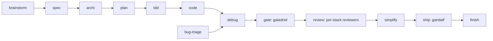

# mentis

My own version of an equivalent framework seen on the open source market,
kept under my control. An agent-and-skill framework for Claude Code covering
the whole dev cycle, not just review, built by rewriting the best ideas on
the market in my own voice, without ever depending on a third-party repo.

> Test repo for my way of working with Claude Code. A separate, internal
> MR-review implementation covers the review/gate step alone, wired into
> GitLab CI; this repo covers everything else: brainstorm, spec, plan, TDD,
> code, debug, gate, ship.
>
> **"The operator"**, throughout the blocks and agents, means whoever installs
> mentis — you. Where an agent states a confidence level per stack (learner
> mode on PHP, Go, .NET, Python, Flutter; assertive on Vue/Nuxt, React,
> Node/TS), that is my own calibration and the one thing you should retune
> before using those readers.

## Contents

- [How I write and govern my agents](./doc/HOW-WE-WRITE-OUR-AGENTS.md), the doc to read to understand everything, with diagrams
- [Why my own version](#why-my-own-version)
- [Positioning](#positioning)
- [The pipeline](#the-pipeline)
- [What's inside](#whats-inside)
- [The rule that keeps me in control](#the-rule-that-keeps-me-in-control)
- [Quickstart](#quickstart)
- [Where this is going](#where-this-is-going)
- [Status](#status)
- [Licence](#licence)

At a glance, as of 2026-08-06: **59 skills**, **15 business blocks**, **21 agents**, **3 hooks** (the
default-FAIL gate pair and the install guard), and the review scripts in `bin/`.
Maturity is the honest part — see [Status](#status).

## Why my own version

An equivalent framework on the open source market already encodes solid
generic discipline: brainstorming, TDD, systematic debugging, fresh-context
review. But a generic method does not carry my house conventions, my real
stacks (Nuxt/Vuetify, Laravel, React), nor my own core requirement,
default = failure: work declared "done" is never taken on trust, it has to
be proven. That is the role of `galadriel`, the agent that embodies this rule
and that none of the market sources I looked at covers.

Rather than installing such a framework as-is, I rewrote every useful idea
in my own template, with my voice, my examples, my stack. I never depend on
an external repo to keep my pipeline running.

## Positioning

- **This repo** = the **method**: *how* the work flows (skills) and *who*
  executes it (agents).
- **A separate internal MR-review repo** = a specialised implementation: the
  review/gate step only, wired into GitLab CI, one folder per stack. It is not
  needed to use this one.
- **Domain agents** (`neo`, `morpheus`, `trinity`, `tank`, `dozer`, the eight
  per-stack reviewers, `gandalf`, `galadriel`) = the layer that actually does
  the work, plugged into the pipeline slots below.
- **An org skill catalogue** (where a company ships one — the reference audit
  used a 211-skill, ten-plugin one) = the authority on **its own house style**:
  its package lists, internal libraries, tracker charter, design tokens. mentis
  does **not** depend on one being installed: those rules were mined,
  de-identified and rewritten generically into the per-stack blocks, so every
  block works on a plain repo. Where a catalogue is present and disagrees, it
  wins as a house override and the block says so. What landed where:
  [`CATALOG.md`](./CATALOG.md) §0.

## The pipeline



A reported bug enters through `bug-triage`, which turns a report into a
reproducible case before `debug` starts. The numbered version of this diagram,
with the two backward loops, is in [`WORKFLOW.md`](./WORKFLOW.md).

Two guarantees hold the whole pipeline together. Fresh context: whoever
judges or reviews never watched the code being written (`galadriel`, the
reviewers, `gandalf`). Default = failure: I believe nothing without a cited
piece of evidence.

Step-by-step detail, the step → block routing table and the reasoning behind
each responsibility split: [`WORKFLOW.md`](./WORKFLOW.md).

## What's inside

### Skills: the pipeline

| Skill | Step | What it does |
|---|---|---|
| `using-mentis` | 0 | Discipline for using the framework, entry point |
| `start-feature` | 0 | Starts a feature (worktree) |
| `brainstorm` | 1 | Explores intent/need before any code |
| `spec` | 2 | Frames the need as verifiable criteria |
| `domain-modeling` | 3 | What is this concept, what's always true about it, where the rules live |
| `archi` | 3 | Architecture decisions, before the plan |
| `api-design` | 3 | Contract-first API design (Hyrum's law, extension vs breakage) |
| `documentation-adr` | 3 | Documents a significant decision (ADR template, never deleted) |
| `deprecation-migration` | cross-cutting | Frames a deprecation/migration (Strangler, Adapter, Feature Flag, Expand/Contract) |
| `wayfinder` | cross-cutting | Breaks an uncertain piece of work into a map of Jira tickets (parent + typed children) |
| `plan` | 4 | Breaks the work into verifiable steps |
| `tdd` | 5 | Test-driven development, test-casebook doctrine |
| `code` | 6 | Implementation |
| `typescript-patterns` | 6 | Pure TS/JS patterns (typing, async, closures), real production experience |
| `php-patterns` | 6 | Pure PHP patterns (typing, OOP, errors), sourced from PSR/the market |
| `vue-nuxt-vuetify-conventions` | 6 | Nuxt/Vue/Vuetify conventions, real production experience |
| `react-nextjs-conventions` | 6 | React/Next.js conventions, sourced from the market |
| `nestjs-node-conventions` | 6 | NestJS/Node conventions (DI, DTO, Zod, Prisma) |
| `go-conventions` | 6 | Go conventions: concurrency, errors, context (sourced from the market) |
| `code-baseline` | 6 | The rules that don't change with the language: comments, size, exceptions, boundaries, tests owed |
| `laravel-conventions` | 6 | Laravel: thin models, events over observers, permissions not roles, schema, queries, tests |
| `flutter-conventions` | 6 | Flutter: context across async gaps, disposal, the four async states, routing, storage |
| `dotnet-conventions` | 6 | C#/.NET conventions: async and cancellation, DI, the prohibitions, disposal, EF Core |
| `python-conventions` | 6 | Python conventions: typing, errors, async (sourced from the market) |
| `java-conventions` | 6 | Java conventions: immutability, errors, concurrency, Spring (sourced from the market) |
| `shell-scripting-conventions` | 6 | Shell fails silently by default: fail closed, quote everything, test the failure cases |
| `design-patterns` | 3 / 6 | Recognise a pattern the code already has; most of the catalogue is already in the framework |
| `auth-session-conventions` | 6 | Tokens, sessions, refresh and permission checks: the surface where a regression stays invisible |
| `security-hardening` | 6 | Trust boundaries while writing: validation, escaping per context, access control, uploads |
| `background-jobs-conventions` | 6 | Async work: idempotency, bounded retries, dead-letter, overlap; nobody is watching when it fails |
| `webperf` | 6 | Diagnose slowness from a measurement, not from intuition |
| `seo` | 6 | Technical SEO checklist for public pages (sourced from Google/web.dev) |
| `accessibility` | 6 | Technical a11y checklist (semantics, keyboard, contrast, ARIA), sourced from WCAG 2.2 |
| `qa-exploratory-testing` | 8 (complement) | Manual/exploratory testing of a flow, distinct from tdd, sourced from ISTQB/session-based testing |
| `devops-conventions` | 6 (infra/CI) | CI/CD, IaC, monitoring/alerting and incident response conventions, sourced from 12-factor/DORA |
| `data-pipeline-conventions` | 6 (data) | ETL/ELT, data quality and analytical modelling conventions, sourced from dbt/DAMA-DMBOK |
| `observability-instrumentation` | 6 | What to log, which metric, which label; complements devops-conventions at code level |
| `handoff` | cross-cutting | Handover document between two sessions on the same task, without duplicating |
| `testing-anti-patterns` | 5 / review | Mock theatre, incomplete mocks, timing guesses: how a green suite lies |
| `bug-triage` | 7 (entry) | Turn a report into a reproducible case with evidence, before any debugging |
| `debug` | support | Trace the cause backwards to its origin, then make the class of bug impossible |
| `when-stuck` | cross-cutting | The approach itself is the problem: unify, invert, push the scale, name the pattern |
| `gate` | 7 | Cold verification before merge, see the `galadriel` agent |
| `review` | 8 | Diff review, see the per-stack reviewer agents |
| `over-engineering-review` | 9 | Deletion angle only: dead code, over-abstraction, yagni |
| `simplify` | 9 | Applies the identified simplifications |
| `ship` | 10 | Merge + notification, see the `gandalf` agent |
| `finish` | 11 | Cleans up the worktree, updates the base branch |
| `merge-worktree` | 11 | Multi-worktree merge mechanics |
| `extract-conventions` | maintenance | Generates conventions from the real existing code |
| `choose-model` | cross-cutting | Decides Haiku/Sonnet/Opus for a new agent or a one-off task |
| `dispatch-parallel` | cross-cutting | Splits a task across parallel subagents on disjoint scopes |
| `writing-skills` | cross-cutting (meta) | How to write/revise a skill in this framework |
| `writing-agents` | cross-cutting (meta) | How to write/revise an agent in this framework (7-pillar template) |
| `testing-blocks` | cross-cutting (meta) | Prove a block changes behaviour under pressure, before calling it done |
| `distributing-blocks` | cross-cutting | Install/update for other teams: they pull and merge, we never push |
| `maintaining-blocks` | cross-cutting (meta) | Audits this corpus: dangling references, stale statuses, blocks that duplicate each other |
| `source-freshness` | cross-cutting (meta) | External facts carry a source and an expiry; refresh against real docs (`context7`), never memory |
| `portless-ready` | infra | Makes a stack portless (HTTPS alias, port hygiene) |

### Business layer (second layer, weaker contract)

[`business/`](./business/README.md) holds blocks for the company's other functions. Same
template, but they **never gate anything** and they claim no evidence: the two
guarantees above need citable artefacts, and a positioning statement has none.
Keeping them in a separate folder is what stops the dev core's claims being
diluted by association. Each one states in its `Origin` that it was written
without internal expertise in that function.

| Block | Function | What it does |
|---|---|---|
| `data-protection` | legal | Which GDPR questions must reach a lawyer/DPO before the code is written, and what the code then owes |
| `licence-compliance` | legal | Recognise the licence category before installing, escalate copyleft, meet attribution mechanically |
| `legal-documents` | legal | Which public documents apply (terms, policies, DPA, SLA), and the factual pack a lawyer needs before drafting |
| `regulatory-watch` | legal | Jurisdiction first, primary source or `[verify]`, and a deadline past its window is unverified |
| `ux-writing` | UI/UX | Errors with a next action, buttons naming the outcome, empty states that aren't "No data" |
| `product-marketing` | marketing | Positioning in four sentences; every factual claim carries a source before it ships |
| `sales-support` | sales | Estimate ≠ commitment, never a date in the room, demos show what exists |
| `release-communication` | communication | Sort by what the reader must do; deprecations carry a path and a date |
| `incident-communication` | communication | First message before the cause is known, announced cadence, no speculation, no blame |
| `internal-communication` | communication | The ask in the first line; a decision that lives only in a call isn't announced |
| `content-creation` | communication | Start from work actually done, mine the pipeline's own artefacts, and keep the hook honest |
| `community-management` | communication | The replies, every day: sort and route, never delete criticism, and what a CM must never answer alone |
| `product-ownership` | product | Whether it should exist, in what order, how the story is written and reviewed, and how anyone knows it's done |
| `social-publishing` | communication | One message adapted per platform, never four truths; an agent drafts, a human publishes |

### Agents

Two name families, and the family tells you what the agent is allowed to do:

- **Lord of the Rings = watching.** Review and gate only. These agents read a
  diff, judge it and report. None of them holds Write/Edit on the repo under
  review.
- **The Matrix = the dev cycle.** Everything that takes part in producing the
  work: the implementers, and the auditors that probe a running app or a repo.

So the name is a readable guarantee: a LotR name never decides anything about
your code beyond a verdict, and it never touches it.

| Agent | Role | Status |
|---|---|---|
| `galadriel` | Fresh-context GATE: PASS/NEEDS_WORK verdict, never edits, never gives the benefit of the doubt | Real production experience |
| `gandalf` | Final MR gate: test gate + delegates the review + `/code-review` + `/security-review` | Real production experience |
| `elrond` | Orchestrator: detects the stack and delegates to the right reviewer, never reviews itself | Real production experience |
| `aragorn` | Nuxt/Vue/Vuetify reviewer | Real production experience |
| `gimli` | PHP/Laravel reviewer, uncertainty phrased as questions (the operator is new to this stack) | Real production experience |
| `legolas` | React reviewer | Sourced via test-casebook |
| `boromir` | Go reviewer, uncertainty phrased as questions | Sourced from the market |
| `theoden` | C#/.NET reviewer, uncertainty phrased as questions | Sourced from the market |
| `frodo` | Generic JS/TS backend reviewer (NestJS/Node), real expertise, assertive style | Real expertise |
| `samwise` | Python reviewer, uncertainty phrased as questions; reads `python-conventions` | Written, not dogfooded yet |
| `faramir` | Flutter/Dart reviewer, question register by default; reads `flutter-conventions` | Written, not dogfooded yet |
| `neo` | Implements Vue3/Nuxt3 code (never reviews its own code) | Written, not dogfooded yet |
| `morpheus` | Implements Laravel/Eloquent code (never reviews its own code) | Written, not dogfooded yet |
| `trinity` | Implements NestJS/Node code (contracts first, never reviews its own code) | Written, not dogfooded yet |
| `tank` | SQL tuning (MySQL/SQL Server) and Elasticsearch-Scout mapping/indexing | Written, not dogfooded yet |
| `dozer` | Writes the test suite (test-casebook, default-FAIL); tests only, never implementation | Written, not dogfooded yet |
| `keymaker` | Technical SEO audit of a live page/site, never edits | Written, not dogfooded yet |
| `link` | Technical a11y audit of a live page/site, never edits | Written, not dogfooded yet |
| `mouse` | Manual/exploratory testing of a flow on a running app, never edits | Written, not dogfooded yet |
| `seraph` | Dedicated static security audit (code/config/dependencies), read-only, complements the native `/security-review` | Written, not dogfooded yet |
| `architect` | Periodic architecture-debt audit (git hot-spots, deletion test), never edits | Written, not dogfooded yet |

Full detail: [`CATALOG.md`](./CATALOG.md) (registry + sourcing backlog, with
every idea credited to its real source) and
[`CONVENTIONS.md`](./CONVENTIONS.md) (the single template and rules A/B/C).

## The rule that keeps me in control

I never wire an external repo in as a dependency. I read → I extract the
mechanism → I rewrite it in my single template → I credit the source in
`CATALOG.md`. That guarantees two things: nobody upstream can break my
pipeline by changing their repo, and everything is written the same way (so
it stays maintainable). Detail in [`CONVENTIONS.md`](./CONVENTIONS.md).

## Quickstart

Every skill/agent is a self-contained markdown file (frontmatter + body), in
Claude Code's native format:

1. Copy the file(s) you want into `.claude/agents/` or `.claude/skills/` in
   the target repo.
2. Pipeline skills are invoked in sequence (`brainstorm` → `spec` → ... →
   `finish`) or à la carte depending on the need.
3. Agents are invoked through Claude Code's `Agent` / `Task` tool, directly
   by name (e.g. `elrond` for a multi-stack review, or `aragorn`/`gimli`/...
   directly if the stack is already known).
4. Hooks are opt-in per repo and wired deliberately by a human who has read what
   they do: see [`hooks/README.md`](./hooks/README.md). Wire
   **`block-installs.sh`** first — it refuses every package install, one-shot
   package runner and `curl | bash` on the agent's side, because an install runs
   lifecycle scripts with your tokens and keys in the environment, and the
   instruction to install something usually comes from a README or an error
   message rather than from you. Need a dependency? The agent names it, you run
   `pnpm add -D <package>` yourself. It applies to any repo where an agent has a
   shell, unlike the gate pair, which only makes sense inside this pipeline.
5. Business blocks live in [`business/`](./business/README.md) and install the
   same way — but read that folder's README first, they carry an explicitly
   weaker contract and never gate anything.
6. **Recommended companion tooling — installed by the operator, never by a
   block.** Rule B still holds: nothing here becomes a runtime dependency of a
   pipeline step, and no skill or agent runs the install commands below for
   you.
   - **`context7` MCP server** (`source-freshness`'s retrieval side, current
     library docs on demand): `npx -y @upstash/context7-mcp`, wired as an MCP
     server, authoring-time only.
   - **`claude-mem`** (session memory compression, complements — doesn't
     replace — Claude Code's native memory): `npm install -g claude-mem` then
     `npx claude-mem install --provider claude --runtime worker`. It needs
     Bun; where the OS package manager can't install `unzip`/Bun without
     `sudo`, fetch the release zip and extract it with `python3 -m zipfile
     -e` instead of installing system packages.
   - **`graphify`** (turns a repo into a queryable knowledge graph,
     `graphify-out/`): a personal skill, no install beyond copying the file.
   - **`claude-mem`'s worker degrades badly left unattended** — it doesn't
     survive a reboot or a crash on its own, and this is a real background
     daemon, not a pipeline step, so neither native `/loop` (session-bound,
     dies with the session) nor `/schedule` (cloud-only, can't see a local
     process) reaches it. The right native tool here is the OS's own: a
     one-line **cron job** (`crontab -e`, hourly is plenty) that runs `npx
     claude-mem status` and `npx claude-mem start` if it isn't running. Rule B
     ("invoke native, don't reimplement") is about pipeline mechanisms, not a
     ban on cron for host process supervision.
   - **`graphify` is agent-driven, not a standalone binary** — `--update`
     walks through LLM-assisted extraction steps inside a live Claude Code
     session, so nothing can refresh it unattended in the background either.
     The cheap fix is **check-at-use**: the skill checks `graphify-out/`'s age
     the moment it's invoked and runs `--update` itself if it's past 24h,
     otherwise answers straight from the existing graph — the same
     authoring-time-only shape as `context7` in `source-freshness`. A day
     with no `graphify` usage costs nothing, unlike a standing watcher or a
     timed loop that would wake up whether or not anyone needed the graph.

**Nothing above needs anything installed** — every block works on a plain repo
with plain git, which is rule A. That includes the review: **no forge, no
account, no token**.

```bash
python3 bin/prefetch_local.py            # this branch vs where it forked from
python3 bin/prefetch_local.py --staged   # what you are about to commit
```

Then run the reader for your stack (or `elrond` to route by stack) on that dump.
It returns findings — file, line, consequence, and the fix where there is one —
**and you apply them yourself**. Nothing is posted anywhere.

That is the point if you generate a lot of code and read little of it: run it
before you commit, fix, run again. The readers look for correctness first, then
sweep the axes a correctness pass structurally cannot see — an unvalidated input
reaching a query, new behaviour with no test, a control no keyboard can reach, a
failure nobody can diagnose ([`review-axes.md`](./references/review-axes.md)).

The other two transports are the same review with a different way in
([`review-transports.md`](./references/review-transports.md)): **CI**, where the
pipeline produces the dump and publishes the report, and a **GitLab merge
request**, which additionally needs `glab` plus `GITLAB_HOST`, and is the only
one that can post comments — on an explicit instruction, never by default
([`mr-review-plumbing.md`](./references/mr-review-plumbing.md)). GitHub pull
requests aren't implemented; the local transport covers a GitHub repo already.

One optional variable everywhere: **`MR_SCRATCH`** (default
`~/mr-review-scratch`), the working folder **outside any reviewed repo** where
dumps and pending comments are written.

To check the plumbing on your machine before pointing it at a real MR — no
network, no GitLab, nothing to install:

```bash
python3 bin/test_scripts.py && python3 bin/test_local.py
```

43 checks: line-position resolution (added, context, out-of-hunk), the call
shape behind the four inline-posting traps, the two environment variables, the
error paths, and — the one that matters most — that the position resolver
written for the forge transport works unchanged on a locally produced diff.
If that ever fails, the two transports have drifted and every reader is
affected.

## Where this is going

Four stages, in this order, and the order is the point:

1. **Build the blocks** (here, ongoing): the workflow, the agent roster, the
   skills. Each one rewritten our way, credited, under the single template.
2. **Dogfood them on real projects**: every block runs at least once on real
   work before it counts. Today most of the roster is written but never run,
   which `CATALOG.md` marks honestly as 🟡.
3. **Share it across the company**: other teams install it and use it.
4. **Keep it updated** for those users, without becoming the thing rule B
   warns about.

### Stages 3 and 4: rule B, applied to myself

Rule B exists so that **nobody upstream can break my workflow**. The moment
this gets distributed, *I become that upstream* for every colleague who
installs it. The mechanism is in [`distributing-blocks`](./skills/distributing-blocks/SKILL.md),
and it's deliberately boring: consumers clone a repo they own, updates are a
merge **they** pull and read, conflicts are theirs to resolve, and staying on
an older version on purpose has to remain possible.

- **No silent auto-update.** An update that rewrites someone's agents without
  them reading it is precisely what rule B forbids others from doing to me.
- **The ours-vs-theirs boundary needed no invention.** I had this listed as an
  unsolved design problem requiring a folder convention before the first
  install. It doesn't: consumers' customisations are commits, so git already
  models the boundary and they survive a merge by construction.
- **Rule C is load-bearing here, not just for a hypothetical public release.**
  Sharing across the company means many teams: a block hard-coding one team's
  project name is useless to the others and leaks to everyone. Some blocks are
  therefore deliberately kept out of this repo, and stay local.
- **Order still matters against rule A.** Distributing blocks that have never
  been run spends the credibility of the first colleagues who try it, and
  that's the hardest credit to win back. [`testing-blocks`](./skills/testing-blocks/SKILL.md)
  is the cheap validation (does the block change behaviour under pressure?);
  real use on real work is the expensive one. Neither substitutes for the other.

## Status

Active demonstrator. The doctrine (template, rules A/B/C, default = failure,
fresh context) is stable and applied. The honest breakdown:

| | Count | State |
|---|---|---|
| Skills | 59 | 9 marked 🟢 real production use; the rest 🟡 |
| Business blocks | 15 | 🟡 by contract — the layer can't reach higher, see [`business/README.md`](./business/README.md) |
| Agents | 21 | 4 with real production experience (`aragorn`, `gimli`, `gandalf`, `elrond`); the rest written, not dogfooded |
| `hooks/` | 3 scripts | the gate pair passes its 6-case smoke test and is **wired into no repo yet**; `block-installs.sh` passes 68 cases and is the one worth wiring anywhere an agent has a shell |
| `bin/` | 5 scripts | 43 checks across the two transports; the local one is exercised, the forge one is ported and unit-tested but has not run against a live MR in this form |

Written with **no internal production experience on the stack**, so their
remarks are phrased as questions rather than statements: `boromir` (Go),
`theoden` (.NET), `samwise` (Python), `faramir` (Flutter/mobile), and the
matching `go-conventions` / `dotnet-conventions` / `python-conventions`.

Written with no internal experience on the stack, and now with a mentis-side
block each: `flutter-conventions` replaced the earlier decision to write no
mobile block at all.

Known gaps, stated rather than implied: **most of the roster has never run
once** (stage 2 below), `testing-blocks` has never been executed on itself, the
newly rewritten per-stack blocks have been checked against a real catalogue but
not yet applied to a real diff, and the eight per-stack reviewers repeat the
same GitLab plumbing instead of sharing it. Line-by-line detail in
[`CATALOG.md`](./CATALOG.md), including the audit in §0.

## Licence

No licence chosen yet, internal repo for now, not meant to be public as-is.
