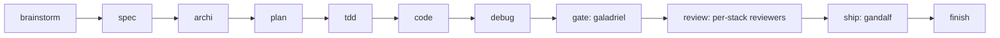

# mentis

My own version of an equivalent framework seen on the open source market,
kept under my control. An agent-and-skill framework for Claude Code covering
the whole dev cycle, not just review, built by rewriting the best ideas on
the market in my own voice, without ever depending on a third-party repo.

> Test repo for my way of working with Claude Code (g.compigni).
> `xefi-mr-review` (separate repo) is the specialised implementation of the
> review/gate step alone, wired into GitLab CI. This repo covers everything
> else: brainstorm, spec, plan, TDD, code, debug, gate, ship.

## Contents

- [How I write and govern my agents](./doc/HOW-WE-WRITE-OUR-AGENTS.md), the doc to read to understand everything, with diagrams
- [Why my own version](#why-my-own-version)
- [Positioning](#positioning)
- [The pipeline](#the-pipeline)
- [What's inside](#whats-inside)
- [The rule that keeps me in control](#the-rule-that-keeps-me-in-control)
- [Quickstart](#quickstart)
- [Status](#status)
- [Licence](#licence)

## Why my own version

An equivalent framework on the open source market already encodes solid
generic discipline: brainstorming, TDD, systematic debugging, fresh-context
review. But a generic method does not carry my Xefi conventions, my real
stacks (Nuxt/Vuetify, Laravel, React), nor my own core requirement,
default = failure: work declared "done" is never taken on trust, it has to
be proven. That is the role of `galadriel`, the agent that embodies this rule
and that none of the market sources I looked at covers.

Rather than installing such a framework as-is, I rewrote every useful idea
in my own template, with my voice, my examples, my stack. I never depend on
an external repo to keep my pipeline running.

## Positioning

- **This repo** = the **method**: *how* the work flows (skills) and *who*
  executes it (agents).
- **`xefi-mr-review`** (separate repo) = a specialised implementation: the
  review/gate step only, wired into GitLab CI, one folder per stack.
- **Domain agents** (`neo`, `morpheus`, `tank`,
  the per-stack reviewers, `gandalf`, `galadriel`) = the layer that actually
  does the work, plugged into the pipeline slots below.

## The pipeline

Two guarantees hold the whole pipeline together. Fresh context: whoever
judges or reviews never watched the code being written (`galadriel`, the
reviewers, `gandalf`). Default = failure: I believe nothing without a cited
piece of evidence.

## What's inside

### Skills: the pipeline

| Skill | Step | What it does |
|---|---|---|
| `using-mentis` | 0 | Discipline for using the framework, entry point |
| `start-feature` | 0 | Starts a feature (worktree) |
| `brainstorm` | 1 | Explores intent/need before any code |
| `spec` | 2 | Frames the need as verifiable criteria |
| `archi` | 3 | Architecture decisions, before the plan |
| `api-design` | 3 | Contract-first API design (Hyrum's law, extension vs breakage) |
| `documentation-adr` | 3 | Documents a significant decision (ADR template, never deleted) |
| `deprecation-migration` | cross-cutting | Frames a deprecation/migration (Strangler, Adapter, Feature Flag, Expand/Contract) |
| `wayfinder` | cross-cutting | Breaks an uncertain piece of work into a map of Jira tickets (parent + typed children) |
| `plan` | 4 | Breaks the work into verifiable steps |
| `tdd` | 5 | Test-driven development, test-casebook doctrine |
| `code` | 6 | Implementation |
| `typescript-patterns` | 6 | Pure TS/JS patterns (typing, async, closures), real production experience |
| `php-patterns` | 6 | Pure PHP patterns (typing, OOP, errors), sourced from PSR/the market |
| `vue-nuxt-vuetify-conventions` | 6 | Nuxt/Vue/Vuetify conventions, real production experience |
| `react-nextjs-conventions` | 6 | React/Next.js conventions, sourced from the market |
| `nestjs-node-conventions` | 6 | NestJS/Node conventions (DI, DTO, Zod, Prisma) |
| `go-conventions` | 6 | Go conventions: concurrency, errors, context (sourced from the market) |
| `dotnet-conventions` | 6 | C#/.NET conventions: async, IDisposable, DI, EF Core (sourced from the market) |
| `python-conventions` | 6 | Python conventions: typing, errors, async (sourced from the market) |
| `java-conventions` | 6 | Java conventions: immutability, errors, concurrency, Spring (sourced from the market) |
| `seo` | 6 | Technical SEO checklist for public pages (sourced from Google/web.dev) |
| `accessibility` | 6 | Technical a11y checklist (semantics, keyboard, contrast, ARIA), sourced from WCAG 2.2 |
| `qa-exploratory-testing` | 8 (complement) | Manual/exploratory testing of a flow, distinct from tdd, sourced from ISTQB/session-based testing |
| `devops-conventions` | 6 (infra/CI) | CI/CD, IaC, monitoring/alerting and incident response conventions, sourced from 12-factor/DORA |
| `data-pipeline-conventions` | 6 (data) | ETL/ELT, data quality and analytical modelling conventions, sourced from dbt/DAMA-DMBOK |
| `observability-instrumentation` | 6 | What to log, which metric, which label; complements devops-conventions at code level |
| `handoff` | cross-cutting | Handover document between two sessions on the same task, without duplicating |
| `debug` | support | Systematic debugging |
| `gate` | 7 | Cold verification before merge, see the `galadriel` agent |
| `review` | 8 | Diff review, see the per-stack reviewer agents |
| `over-engineering-review` | 9 | Deletion angle only: dead code, over-abstraction, yagni |
| `simplify` | 9 | Applies the identified simplifications |
| `ship` | 10 | Merge + notification, see the `gandalf` agent |
| `finish` | 11 | Cleans up the worktree, updates the base branch |
| `merge-worktree` | 11 | Multi-worktree merge mechanics |
| `extract-conventions` | maintenance | Generates conventions from the real existing code |
| `choose-model` | cross-cutting | Decides Haiku/Sonnet/Opus for a new agent or a one-off task |
| `dispatch-parallel` | cross-cutting | Splits a task across parallel subagents on disjoint scopes |
| `writing-skills` | cross-cutting (meta) | How to write/revise a skill in this framework |
| `writing-agents` | cross-cutting (meta) | How to write/revise an agent in this framework (7-pillar template) |
| `portless-ready` | infra | Makes a stack portless (HTTPS alias, port hygiene) |

### Agents

Two name families, and the family tells you what the agent is allowed to do:

- **Lord of the Rings = watching.** Review and gate only. These agents read a
  diff, judge it and report. None of them holds Write/Edit on the repo under
  review.
- **The Matrix = the dev cycle.** Everything that takes part in producing the
  work: the implementers, and the auditors that probe a running app or a repo.

So the name is a readable guarantee: a LotR name never decides anything about
your code beyond a verdict, and it never touches it.

| Agent | Role | Status |
|---|---|---|
| `galadriel` | Fresh-context GATE: PASS/NEEDS_WORK verdict, never edits, never gives the benefit of the doubt | Real production experience |
| `gandalf` | Final MR gate: test gate + delegates the review + `/code-review` + `/security-review` | Real production experience |
| `elrond` | Orchestrator: detects the stack and delegates to the right reviewer, never reviews itself | Real production experience |
| `aragorn` | Nuxt/Vue/Vuetify reviewer | Real production experience |
| `gimli` | PHP/Laravel reviewer, uncertainty phrased as questions (g.compigni is new to this stack) | Real production experience |
| `legolas` | React reviewer | Sourced via test-casebook |
| `boromir` | Go reviewer, uncertainty phrased as questions | Sourced from the market |
| `theoden` | C#/.NET reviewer, uncertainty phrased as questions | Sourced from the market |
| `frodo` | Generic JS/TS backend reviewer (NestJS/Node), real expertise, assertive style | Real expertise |
| `neo` | Implements Vue3/Nuxt3 code (never reviews its own code) | Written, not dogfooded yet |
| `morpheus` | Implements Laravel/Eloquent code (never reviews its own code) | Written, not dogfooded yet |
| `tank` | SQL tuning (MySQL/SQL Server) and Elasticsearch-Scout mapping/indexing | Written, not dogfooded yet |
| `keymaker` | Technical SEO audit of a live page/site, never edits | Written, not dogfooded yet |
| `link` | Technical a11y audit of a live page/site, never edits | Written, not dogfooded yet |
| `mouse` | Manual/exploratory testing of a flow on a running app, never edits | Written, not dogfooded yet |
| `seraph` | Dedicated static security audit (code/config/dependencies), read-only, complements the native `/security-review` | Written, not dogfooded yet |
| `architect` | Periodic architecture-debt audit (git hot-spots, deletion test), never edits | Written, not dogfooded yet |

Full detail: [`CATALOG.md`](./CATALOG.md) (registry + sourcing backlog, with
every idea credited to its real source) and
[`CONVENTIONS.md`](./CONVENTIONS.md) (the single template and rules A/B/C).

## The rule that keeps me in control

I never wire an external repo in as a dependency. I read → I extract the
mechanism → I rewrite it in my single template → I credit the source in
`CATALOG.md`. That guarantees two things: nobody upstream can break my
pipeline by changing their repo, and everything is written the same way (so
it stays maintainable). Detail in [`CONVENTIONS.md`](./CONVENTIONS.md).

## Quickstart

Every skill/agent is a self-contained markdown file (frontmatter + body), in
Claude Code's native format:

1. Copy the file(s) you want into `.claude/agents/` or `.claude/skills/` in
   the target repo.
2. Pipeline skills are invoked in sequence (`brainstorm` → `spec` → ... →
   `finish`) or à la carte depending on the need.
3. Agents are invoked through Claude Code's `Agent` / `Task` tool, directly
   by name (e.g. `elrond` for a multi-stack review, or `aragorn`/`gimli`/...
   directly if the stack is already known).

## Status

Active demonstrator: my doctrine (template, rules A/B/C, default = failure,
fresh context) is stable and applied, some agents have real production
experience (`aragorn`, `gimli`, `gandalf`, `galadriel`, `elrond`), others are
written but not dogfooded yet (`neo`, `morpheus`,
`tank`) or sourced from the market with no internal experience yet
(`boromir`, `theoden`, `go-conventions`, `dotnet-conventions`). The exact
line-by-line detail is in `CATALOG.md`.

## Licence

No licence chosen yet, internal repo for now, not meant to be public as-is.
