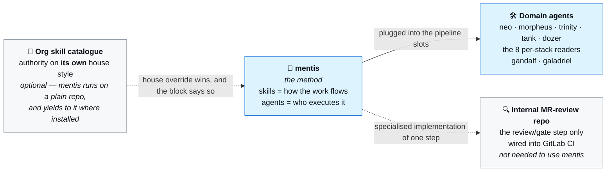
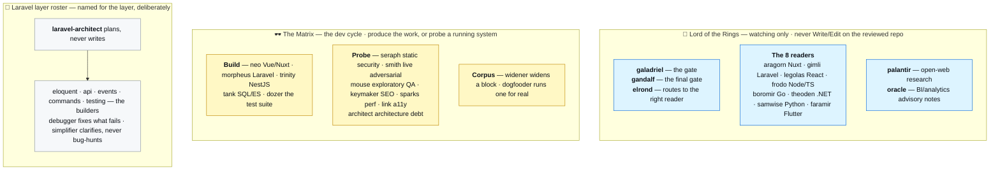
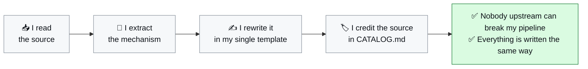
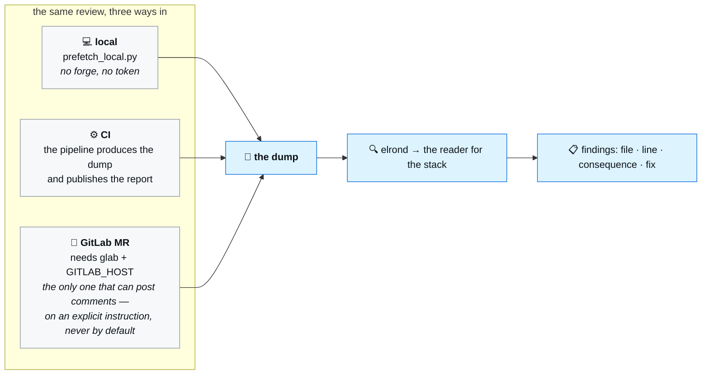
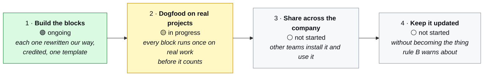

<h1 align="center">mentis</h1>

<p align="center">
  <em>An agent-and-skill framework for Claude Code covering the whole dev cycle — not just review.</em><br>
  <em>Every useful idea on the market, rewritten in my own voice, in one template, depending on no upstream repo.</em>
</p>

<p align="center">
  
  
  
  
  
  
  
</p>

> [!NOTE]
> **"The operator"**, throughout the blocks and agents, means whoever installs mentis — you.
> Where an agent states a confidence level per stack (**learner** register on PHP, Go, .NET, Python,
> Flutter; **assertive** on Vue/Nuxt, React, Node/TS), that is my own calibration and the one thing
> you should retune before using those readers.

Test repo for my way of working with Claude Code. A separate, internal MR-review implementation
covers the review/gate step alone, wired into GitLab CI; **this repo covers everything else**:
brainstorm → spec → plan → TDD → code → debug → gate → ship.

---

## At a glance

| | Count | Maturity |
|---|---:|---|
| 🧩 **Skills** — the method, one file per rule | **105** | 🟢 9 with real production use · 🟡 the rest written, not run |
| 🤖 **Agents** — who executes it | **35** | 🟢 21 dogfooded or production-run · 🟡 the rest written |
| 💼 **Business blocks** — the company's other functions | **24** | 🟡 by contract, they never gate ([why](./business/README.md)) |
| 🪝 **Hooks** — the gate pair, the test guard, the install guard | **4** | 🟢 wired into one real repo, 2026-09-09 |
| 🧪 **`bin/`** — review transports + repo self-checks | **9 scripts / 9 suites** | 🟢 216 checks, run on every push |

**Maturity legend** — 🟢 has run on real work · 🟡 written, reviewed, never run.
The line-by-line breakdown is [`CATALOG.md`](./CATALOG.md); the summary is [Status](#status).

<table>
<tr>
<td width="50%" valign="top">

**Start here**

- 📖 [How I write and govern my agents](./doc/HOW-WE-WRITE-OUR-AGENTS.md) — the doc to read to understand everything, with diagrams
- 🧭 [`WORKFLOW.md`](./WORKFLOW.md) — the numbered pipeline, step → block routing
- 📚 [`CATALOG.md`](./CATALOG.md) — the registry, every idea credited to its real source
- 📐 [`CONVENTIONS.md`](./CONVENTIONS.md) — the single template, rules A/B/C
- 🖥️ [The native platform surface](./references/claude-code-platform.md) — what Claude Code already provides, so no block reimplements it

</td>
<td width="50%" valign="top">

**On this page**

- [Why my own version](#why-my-own-version)
- [Positioning](#positioning)
- [The pipeline](#the-pipeline)
- [What's inside](#whats-inside)
- [The rule that keeps me in control](#the-rule-that-keeps-me-in-control)
- [Public repo, protected branch](#public-repo-protected-branch) · [Versioning](#versioning)
- [Quickstart](#quickstart)
- [Running a review](#running-a-review)
- [Maintaining this repo](#maintaining-this-repo)
- [Where this is going](#where-this-is-going) · [Status](#status)

</td>
</tr>
</table>

### Two things worth knowing before the tour

> [!IMPORTANT]
> **20 of the 35 agents deny their forbidden tools in the frontmatter**, not only in their prose.
> Twelve of them had carried *"Never Write/Edit: you fix nothing, you report"* while the runtime
> handed them every tool — a guarantee that held only as long as the model chose to honour it, which
> is precisely the thing this repo refuses to accept from anyone else. The implementers write code
> and are untouched. The one prohibition still resting on trust is the readers'
> *"write only inside the scratch directory"*, because `disallowedTools` cannot be scoped to a path,
> and each reader's contract now says so explicitly instead of implying the runtime has it covered.

**What a session actually loads.** Every block description sits in the system prompt of every session
whether or not it gets used, so they are sized for routing, not for summarising: **~23 KB** for the whole
corpus. A block is loaded whole when invoked, so the five big convention blocks are a `Steps` table
naming, per section, the condition under which that section has to be read — a task touching two of
them loads **9 KB rather than 26 KB**. What the agents write back is capped too
([`terse-reporting.md`](./references/terse-reporting.md)): verdict first, one line per finding, no
preamble — with negation, verdict word, confidence level and quoted evidence explicitly exempt from
the compression.

---

## Why my own version

An equivalent framework on the open source market already encodes solid generic discipline:
brainstorming, TDD, systematic debugging, fresh-context review. But a generic method does not carry
my house conventions, my real stacks (Nuxt/Vuetify, Laravel, React), nor my own core requirement —
**default = failure**: work declared "done" is never taken on trust, it has to be proven. That is the
role of [`galadriel`](./agents/galadriel.md), the agent that embodies this rule and that none of the
market sources I looked at covers.

Rather than installing such a framework as-is, I rewrote every useful idea in my own template, with
my voice, my examples, my stack. **I never depend on an external repo to keep my pipeline running.**

## Positioning



The reference audit answered a 211-skill, ten-plugin catalogue. Those rules were mined, de-identified
and rewritten generically into the per-stack blocks, so **every block works on a plain repo**. What
landed where: [`CATALOG.md`](./CATALOG.md) §0.

## The pipeline

```mermaid
flowchart LR
    subgraph FRAME["🧭 Frame"]
      direction LR
      S["0 · start-feature"] --> A["1 · brainstorm"] --> B["2 · spec"] --> C["3 · archi"] --> D["4 · plan"]
    end
    subgraph BUILD["🔨 Build"]
      direction LR
      E["5 · tdd<br/><i>dozer</i>"] --> F["6 · code<br/><i>neo · morpheus · trinity · tank</i>"] --> G["debug"]
    end
    subgraph PROVE["🛡️ Prove — fresh context only"]
      direction LR
      H["7 · gate<br/><i>galadriel</i>"] --> I["8 · review<br/><i>elrond → the readers</i>"] --> J["9 · simplify"]
    end
    subgraph SHIP["🚀 Ship"]
      direction LR
      K["10 · ship<br/><i>gandalf</i>"] --> L["11 · finish"]
    end

    D --> E
    G --> H
    J --> K
    BUG(["🐞 a reported bug"]) --> T["bug-triage"] --> G

    H -. "NEEDS_WORK — measurable exit, driven by /goal" .-> F
    I -. "findings — manual, turn-based" .-> F

    classDef frame fill:#f6f8fa,stroke:#8c959f,color:#0d1117
    classDef build fill:#fff8c5,stroke:#bf8700,color:#0d1117
    classDef prove fill:#ddf4ff,stroke:#0969da,color:#0d1117
    classDef ship fill:#dafbe1,stroke:#1a7f37,color:#0d1117
    classDef bug fill:#ffebe9,stroke:#cf222e,color:#0d1117
    class S,A,B,C,D frame
    class E,F,G build
    class H,I,J prove
    class K,L ship
    class BUG,T bug
```



**Exactly two loops close backwards**, and only these two: the gate returning `NEEDS_WORK`, and the
review producing findings. Both land back in `code`; everything else moves forward. A reported bug
enters through `bug-triage`, which turns a report into a reproducible case before `debug` starts.

| Guarantee | What it forbids |
|---|---|
| 🧊 **Fresh context** | Whoever judges never watched the code being written — `galadriel`, the readers, `gandalf` |
| ❌ **Default = failure** | Nothing is believed without a cited piece of evidence. "It works" is a claim until it is an artefact |

Step-by-step detail, the step → block routing table and the reasoning behind each responsibility
split: [`WORKFLOW.md`](./WORKFLOW.md).

---

## What's inside

### 🧩 Skills — the pipeline

<details open>
<summary><b>Pipeline core</b> — the ordered steps, plus the two entries that hang off them</summary>

| Skill | Step | What it does |
|---|---|---|
| `using-mentis` | 0 | Discipline for using the framework, entry point |
| `start-feature` | 0 | Starts a feature (worktree) |
| `brainstorm` | 1 | Explores intent/need before any code |
| `spec` | 2 | Frames the need as verifiable criteria |
| `domain-modeling` | 3 | What is this concept, what's always true about it, where the rules live |
| `archi` | 3 | Architecture decisions, before the plan |
| `api-design` | 3 | Contract-first API design (Hyrum's law, extension vs breakage) |
| `documentation-adr` | 3 | Documents a significant decision (ADR template, never deleted) |
| `plan` | 4 | Breaks the work into verifiable steps |
| `wayfinder` | 4 | Breaks an uncertain piece of work into a map of Jira tickets (parent + typed children) |
| `tdd` | 5 | Test-driven development, test-casebook doctrine |
| `testing-anti-patterns` | 5 / review | Mock theatre, incomplete mocks, timing guesses: how a green suite lies |
| `code` | 6 | Implementation |
| `bug-triage` | 7 (entry) | Turn a report into a reproducible case with evidence, before any debugging |
| `debug` | support | Trace the cause backwards to its origin, then make the class of bug impossible |
| `when-stuck` | cross-cutting | The approach itself is the problem: unify, invert, push the scale, name the pattern |
| `gate` | 7 | Cold verification before merge, see the `galadriel` agent |
| `review` | 8 | Diff review, see the per-stack reviewer agents |
| `qa-exploratory-testing` | 8 (complement) | Manual/exploratory testing of a flow, distinct from tdd, sourced from ISTQB/session-based testing |
| `over-engineering-review` | 9 | Deletion angle only: dead code, over-abstraction, yagni |
| `simplify` | 9 | Applies the identified simplifications |
| `ship` | 10 | Merge + notification, see the `gandalf` agent |
| `finish` | 11 | Cleans up the worktree, updates the base branch |
| `merge-worktree` | 11 | Multi-worktree merge mechanics |
| `deprecation-migration` | cross-cutting | Frames a deprecation/migration (Strangler, Adapter, Feature Flag, Expand/Contract) |
| `handoff` | cross-cutting | Handover document between two sessions on the same task, without duplicating |

</details>

<details>
<summary><b>Stack conventions</b> — the big per-language blocks (14)</summary>

| Skill | What it does |
|---|---|
| `code-baseline` | The rules that don't change with the language: comments, size, exceptions, boundaries, tests owed |
| `design-patterns` | Recognise a pattern the code already has; most of the catalogue is already in the framework; and when one already in the code has stopped earning its place |
| `typescript-patterns` | Pure TS/JS patterns (typing, async, closures), real production experience |
| `php-patterns` | Pure PHP patterns (typing, errors, OOP, comparison and array semantics, time/money/text), sourced from PSR/the market |
| `vue-nuxt-vuetify-conventions` | Nuxt/Vue/Vuetify conventions, real production experience |
| `react-nextjs-conventions` | React/Next.js conventions, sourced from the market |
| `nestjs-node-conventions` | NestJS/Node conventions (DI, DTO, Zod, Prisma) |
| `laravel-conventions` | Laravel: thin models, events over observers, permissions not roles, schema, queries, tests |
| `inertia-conventions` | Laravel + Inertia (Vue/React/Svelte rendered from controllers), and why the REST and Nuxt rules do not apply there |
| `go-conventions` | Go: concurrency, errors, context (sourced from the market) |
| `dotnet-conventions` | C#/.NET: async and cancellation, DI and lifetimes, authorisation, the prohibitions, disposal and nullability, EF Core and portability |
| `python-conventions` | Python: typing, errors, async (sourced from the market) |
| `java-conventions` | Java: immutability, errors, concurrency, Spring (sourced from the market) |
| `shell-scripting-conventions` | Shell fails silently by default: fail closed, quote everything, test the failure cases |

</details>

<details>
<summary><b>Laravel triggers</b> — one rule, one file, fired by the code you are writing (22)</summary>

| Skill | Trigger → rule |
|---|---|
| `laravel-no-db-enums` | A fixed-set column — never a DB-level ENUM, always a PHP backed enum |
| `laravel-no-cascade-delete` | A foreign key or a delete path — never a database-level cascade delete |
| `laravel-no-observers` | A model lifecycle reaction — never an Observer or `boot()`, always an explicit listener |
| `laravel-throw-dont-return-errors` | A failable code path — throw, never build and return the error response by hand |
| `laravel-no-queries-in-loops` | A loop over Eloquent models or an accessor — no query/aggregate per iteration (N+1) |
| `laravel-scope-dont-check-after-fetch` | An id from the request resolved to a model — scope the query, never findOrFail then an ownership check |
| `laravel-prefer-orfail-fetch` | A single-record fetch — prefer findOrFail/firstOrFail over a fetch plus a manual null check |
| `laravel-mail-via-notifications` | A user-facing email or in-app message — always a notification, never hand-built Mail |
| `laravel-no-fat-models` | A model method beyond fillable/casts/relationships — business logic goes to an action/query class |
| `laravel-no-magic-strings` | A bare domain string/number (status, queue name, threshold) — give it an enum/constant/config entry |
| `laravel-pruning-fires-delete-events` | A retention sweep on a soft-deleted model — pruning is deleting, never bypass the per-row events |
| `laravel-idempotent-data-commands` | An artisan command that changes data — idempotent or refuses to run twice, reports counts |
| `laravel-idempotent-seeders` | A reference-data seeder — upsert by natural key, never insert |
| `laravel-seed-new-features` | A change introducing/changing persisted data — ship its seed data in the same change |
| `laravel-idempotent-jobs` | A queued job's `handle()` — assume it may run twice, assert the end state not a delta |
| `laravel-post-may-run-twice` | A row-creating POST endpoint — a DB uniqueness constraint or an idempotency key, never check-then-insert |
| `laravel-no-hand-rolled-content-negotiation` | A controller branching on JSON vs rendered — never, let the framework decide |
| `laravel-api-breaking-changes` | Removing/renaming/narrowing an API field — additive-then-remove, never one commit |
| `laravel-precognitive-request-scoping` | A validation rule checking the request's own not-yet-created data — skip it during precognition |
| `laravel-support-window-date` | Choosing a Laravel/PHP version — the published security end-of-life date settles it |
| `laravel-permissions-not-roles` | An authorisation check naming a role — never, check a permission (`can()`/policy/gate) |
| `laravel-strict-types-default` | A new Laravel file's `strict_types` — default to omitting, matching `artisan make:*`, never retrofit |
| `laravel-date-via-localised-accessors` | Rendering a date as text — the date library's localised accessor, never a hand-rolled lookup array |
| `laravel-recognise-state-machine-or-pipeline` | *"add a publish button"* / *"add a step that also…"* — recognise the state machine or pipeline underneath |
| `laravel-aggregate-in-database` | Counting/summing a relation or collection — in the database, never by hydrating in PHP |

</details>

<details>
<summary><b>Nuxt · Flutter · .NET · Python triggers</b> — same shape, other stacks (20)</summary>

**Nuxt / Vue**

| Skill | Trigger → rule |
|---|---|
| `nuxt-no-props-destructure` | Reading a prop — never `const { foo } = props`, it silently breaks reactivity |
| `nuxt-child-never-mutates-prop` | Writing to a value received as a prop — never, emit or take a v-model instead |
| `nuxt-define-store-once` | A `defineStore()` call — once at module level, never inside a function body |
| `nuxt-no-hydration-nondeterminism` | `Date.now`/`Math.random`/`window`/`document` in setup or a computed — isolate client-side |
| `nuxt-semantic-element-first` | A clickable control — native semantic element or toolkit wrapper, never a clickable div |

**Flutter**

| Skill | Trigger → rule |
|---|---|
| `flutter-context-after-await` | `BuildContext` used after an await — mounted check, capture before await, or never in a state holder |
| `flutter-no-controller-in-build` | A controller/future/stream built inside `build()` — hoist to initState or a late final field |
| `flutter-dispose-what-you-create` | A widget's `dispose()` — never dispose a controller you didn't create |
| `flutter-four-async-states` | A screen rendering async data — loading/success/empty/error, all four, per data source |
| `flutter-no-future-in-state` | A Future/Stream held in state — store the resolved result, never the awaitable |

**C# / .NET**

| Skill | Trigger → rule |
|---|---|
| `dotnet-dispose-what-you-own` | A disposable from DI or a factory — dispose what this code created, never an injected dependency |
| `dotnet-no-swallow-exceptions` | A catch block — never empty or log-only-then-continue on a path that should fail |
| `dotnet-null-pattern-matching` | A null check — `is null`/`is not null`, never `==` inside an equality operator's own body |
| `dotnet-no-ambient-static-state` | A static mutable field or `DateTime.Now` — inject it instead, for testability |
| `dotnet-options-lifetime-mismatch` | Injecting `IOptions*`/Snapshot/Monitor — match the lifetime, never a snapshot in a singleton |

**Python**

| Skill | Trigger → rule |
|---|---|
| `python-no-implicit-truthiness` | A value that could be None/0/empty — never bare `if x`, always `is None`/`is not None` |
| `python-no-bare-except` | A try/except — never a bare except or a silent swallow with no rethrow/log |
| `python-async-no-blocking-calls` | An async function — never blocking I/O or CPU work without isolating it |
| `python-no-db-cascade-delete` | An ORM foreign key — never a DB-side cascade delete, cascade in the ORM layer |
| `python-no-magic-strings` | A bare domain string/number — give it an Enum/StrEnum or a named constant |

</details>

<details>
<summary><b>Cross-cutting quality</b> — the axes a correctness pass structurally cannot see (9)</summary>

| Skill | What it does |
|---|---|
| `auth-session-conventions` | Tokens, sessions, refresh and permission checks: the surface where a regression stays invisible |
| `security-hardening` | Trust boundaries while writing: validation, escaping per context, access control, uploads |
| `background-jobs-conventions` | Async work: idempotency, bounded retries, dead-letter, overlap; nobody is watching when it fails |
| `webperf` | Diagnose slowness from a measurement, not from intuition |
| `seo` | Technical SEO checklist for public pages (sourced from Google/web.dev) |
| `accessibility` | Technical a11y checklist (semantics, keyboard, contrast, ARIA), sourced from WCAG 2.2 |
| `observability-instrumentation` | What to log, which metric, which label; complements `devops-conventions` at code level |
| `devops-conventions` | CI/CD, IaC, monitoring/alerting and incident response, sourced from 12-factor/DORA |
| `data-pipeline-conventions` | ETL/ELT, data quality and analytical modelling, sourced from dbt/DAMA-DMBOK |

</details>

<details>
<summary><b>Meta &amp; maintenance</b> — the blocks that keep the corpus honest (10)</summary>

| Skill | What it does |
|---|---|
| `writing-skills` | How to write/revise a skill in this framework |
| `writing-agents` | How to write/revise an agent in this framework (7-pillar template) |
| `testing-blocks` | Prove a block changes behaviour under pressure, before calling it done |
| `maintaining-blocks` | Audits this corpus: dangling references, stale statuses, blocks that duplicate each other |
| `distributing-blocks` | Install/update for other teams: they pull and merge, we never push |
| `source-freshness` | External facts carry a source and an expiry; refresh against real docs (`context7`), never memory |
| `extract-conventions` | Generates conventions from the real existing code |
| `choose-model` | Decides Haiku/Sonnet/Opus for a new agent or a one-off task |
| `dispatch-parallel` | Splits a task across parallel subagents on disjoint scopes |
| `portless-ready` | Makes a stack portless (HTTPS alias, port hygiene) |

</details>

### 💼 Business layer — second layer, weaker contract

[`business/`](./business/README.md) holds blocks for the company's other functions. Same template,
but they **never gate anything** and they claim no evidence: the two guarantees above need citable
artefacts, and a positioning statement has none. Keeping them in a separate folder is what stops the
dev core's claims being diluted by association. Each one states in its `Origin` that it was written
without internal expertise in that function.

<details>
<summary><b>The 24 business blocks</b>, by function</summary>

| Block | Function | What it does |
|---|---|---|
| `data-protection` | ⚖️ legal | Which GDPR questions must reach a lawyer/DPO before the code is written, and what the code then owes |
| `licence-compliance` | ⚖️ legal | Recognise the licence category before installing, escalate copyleft, meet attribution mechanically |
| `legal-documents` | ⚖️ legal | Which public documents apply (terms, policies, DPA, SLA), and the factual pack a lawyer needs before drafting |
| `regulatory-watch` | ⚖️ legal | Jurisdiction first, primary source or `[verify]`, and a deadline past its window is unverified |
| `fintech-compliance` | ⚖️ legal | Payments, card data, ledgers, KYC: regulatory scope and the engineering invariants that keep it correct |
| `ux-writing` | 🎨 UI/UX | Errors with a next action, buttons naming the outcome, empty states that aren't "No data" |
| `interface-design` | 🎨 UI/UX | Containers, states, design tokens, button hierarchy, chips versus buttons, before it is coded |
| `product-marketing` | 📣 marketing | Positioning in four sentences; every factual claim carries a source before it ships |
| `sales-support` | 💰 sales | Estimate ≠ commitment, never a date in the room, demos show what exists |
| `customer-success` | 💰 sales | Post-sale support (triage, SLAs, escalation) and account health, where `sales-support` stops |
| `release-communication` | 🗣️ communication | Sort by what the reader must do; deprecations carry a path and a date |
| `incident-communication` | 🗣️ communication | First message before the cause is known, announced cadence, no speculation, no blame |
| `internal-communication` | 🗣️ communication | The ask in the first line; a decision that lives only in a call isn't announced |
| `content-creation` | 🗣️ communication | Start from work actually done, mine the pipeline's own artefacts, keep the hook honest |
| `community-management` | 🗣️ communication | The replies, every day: sort and route, never delete criticism, and what a CM must never answer alone |
| `social-publishing` | 🗣️ communication | One message adapted per platform, never four truths; an agent drafts, a human publishes |
| `product-ownership` | 📦 product | Whether it should exist, in what order, how the story is written and reviewed, how anyone knows it's done |
| `data-analytics` | 📊 data | Reporting, dashboards, KPIs and extraction against a landscape split across several systems of record |
| `finance-ops` | 🧾 finance | The company's own financial operations: expense approval, invoicing, budgeting |
| `investor-relations` | 🧾 finance | Data room, board update, due diligence: internal consistency of financials, cap table, KPIs, forecast |
| `people-ops` | 👥 people | Hiring, onboarding, offboarding: a defensible decision, a productive start, a departure that leaks nothing |
| `learning-development` | 👥 people | A real skills gap, a baseline before measuring impact, outcomes tied to something checkable |
| `vendor-management` | 🤝 ops | Security and compliance review before signing a SaaS/vendor contract, and renewal tracking |
| `sustainability-esg` | 🌱 ops | Materiality and evidence behind a sustainability claim, so it does not become greenwashing |

</details>

### 🤖 Agents

**Two name families, and the family tells you what the agent is allowed to do.**



So the name is a readable guarantee: **a LotR name never decides anything about your code beyond a
verdict, and it never touches it.**

**One deliberate exception**: the Laravel layer roster (`laravel-architect` through
`laravel-simplifier`) is named for its layer rather than for either family, on purpose — the whole
point of splitting `morpheus`'s build role into eight was to make the mapping (this layer, that
agent) readable at a glance, which a themed name would hide. They still hold the guarantee the family
names exist to signal: `laravel-architect` never writes, the seven builders never review their own diff.

<details open>
<summary><b>💍 Watching</b> — gate, route, read a diff (13)</summary>

| Agent | Role | Status |
|---|---|---|
| `galadriel` | Fresh-context GATE: PASS/NEEDS_WORK verdict, never edits, never gives the benefit of the doubt | 🟢 Real production experience |
| `gandalf` | Final MR gate: test gate + delegates the review + `/code-review` + `/security-review` | 🟢 Real production experience |
| `elrond` | Orchestrator: detects the stack and delegates to the right reviewer, never reviews itself | 🟢 Real production experience |
| `aragorn` | Nuxt/Vue/Vuetify reviewer | 🟢 Real production experience |
| `gimli` | PHP/Laravel reviewer, uncertainty phrased as questions | 🟢 Real production experience |
| `legolas` | React reviewer | 🟡 Sourced via test-casebook |
| `frodo` | Generic JS/TS backend reviewer (NestJS/Node), assertive register | 🟢 Real expertise |
| `samwise` | Python reviewer, question register; reads `python-conventions` | 🟢 Real review, 2026-09-10 |
| `faramir` | Flutter/Dart reviewer, question register; reads `flutter-conventions` | 🟢 Real review, 2026-09-10 |
| `boromir` | Go reviewer, question register | 🟡 Sourced from the market |
| `theoden` | C#/.NET reviewer, question register | 🟡 Sourced from the market |
| `palantir` | Researches a question on the open web (advisory, fact-check, practice past the cutoff) | 🟢 Real production experience |
| `oracle` | Advisory read of a KPI/dashboard/analytics query — notes, never a gate | 🟡 Written, business-layer contract |

</details>

<details>
<summary><b>🕶️ Building</b> — implementers, probes and corpus agents (14)</summary>

| Agent | Role | Status |
|---|---|---|
| `neo` | Implements Vue3/Nuxt3 code (never reviews its own code) | 🟢 Real build, 2026-09-11 |
| `morpheus` | Implements Laravel/Eloquent end-to-end for a small or mixed-layer change | 🟢 Real production experience |
| `trinity` | Implements NestJS/Node code (contracts first, never reviews its own code) | 🟢 Real build, 2026-09-10 |
| `tank` | SQL tuning (MySQL/SQL Server) and Elasticsearch-Scout mapping/indexing | 🟢 Real EXPLAIN pass on MySQL, 2026-09-11 |
| `dozer` | Writes the test suite (test-casebook, default-FAIL); tests only, never implementation | 🟢 Real run, 2026-09-11 |
| `seraph` | Static security audit (code/config/dependencies), read-only, complements `/security-review` | 🟢 Real audit, 2026-09-11 |
| `smith` | Dynamic adversarial probing on a running app, bounded to an explicitly authorised target | 🟢 Real probe, 2026-09-11 |
| `mouse` | Manual/exploratory testing of a flow on a running app, never edits | 🟢 Real audit, 2026-09-11 |
| `keymaker` | Technical SEO audit of a live page/site, never edits | 🟢 Real audit, 2026-09-11 |
| `sparks` | Real-world performance audit of a live page/screen (Web Vitals, waterfall), never edits | 🟢 Real audit, 2026-09-11 |
| `link` | Technical a11y audit of a live page/site, never edits | 🟢 Real audit, 2026-09-11 |
| `architect` | Periodic architecture-debt audit (git hot-spots, deletion test), never edits | 🟢 Real audit, 2026-09-11 |
| `widener` | Widens a stack block's `references/*.md` against current public docs; never commits | 🟢 A dozen widening rounds |
| `dogfooder` | Builds a small real project against a block's rules and runs the real toolchain; never commits | 🟢 Nine dogfood rounds |

</details>

<details>
<summary><b>🧱 The Laravel layer roster</b> — one agent per layer (8)</summary>

| Agent | Role | Status |
|---|---|---|
| `laravel-architect` | Plans a Laravel feature before code exists: schema, API surface, permission model, breakdown; read-only | 🟢 Real plan, 2026-09-11 |
| `laravel-eloquent-expert` | The data layer: models, migrations, casts, relationships, factories, seeders | 🟢 Real build, 2026-09-11 |
| `laravel-api-expert` | The HTTP layer: routes, controllers, Form Requests, API Resources, lomkit endpoints | 🟢 Real build, 2026-09-11 |
| `laravel-events-expert` | Events, listeners, queued jobs, notifications, mail | 🟢 Real build, 9 tests passed, 2026-09-11 |
| `laravel-commands-expert` | Artisan commands and their scheduling | 🟢 Real build, 2026-09-11 |
| `laravel-testing-expert` | Chooses Feature vs Unit, writes and runs factory-driven tests | 🟢 Found a real race-condition bug, 2026-09-11 |
| `laravel-debugger` | Root-causes and fixes a failing test, a Larastan finding, an exception, a regression | 🟢 Fixed a real bug, 2026-09-11 |
| `laravel-simplifier` | Behaviour-preserving clarity pass on recently modified code, never a bug-hunt | 🟢 Real pass, 2026-09-11 |

</details>

Full detail: [`CATALOG.md`](./CATALOG.md) (registry + sourcing backlog, with every idea credited to
its real source) and [`CONVENTIONS.md`](./CONVENTIONS.md) (the single template and rules A/B/C).

---

## The rule that keeps me in control



**I never wire an external repo in as a dependency.** Detail in [`CONVENTIONS.md`](./CONVENTIONS.md).

## Public repo, protected branch

This repo is public and `master` is protected, for everyone including the owner (`enforce_admins` is
on): **no direct push, no force push, no branch deletion**. Every change — mine included — goes
through a pull request. A review isn't required to merge (no second maintainer reliably available to
give one), but the PR itself, and the trail it leaves, is mandatory.

## Versioning

Every change to `master` gets a semver tag (`vMAJOR.MINOR.PATCH`) so anyone who copied files out of
this repo can tell if they're behind:

| Bump | When |
|---|---|
| 🔴 **MAJOR** | A breaking change — a skill/agent renamed or removed, a gate's behaviour changed |
| 🟡 **MINOR** | A new skill, agent, hook, or business block added |
| 🟢 **PATCH** | A fix, or a doc/wording change to something that already exists |

```bash
git -C mentis fetch --tags && git -C mentis tag -l
```

…or point Renovate/Dependabot at this repo's tags if you want it automated. There's no npm package
here on purpose — mentis is markdown consumed by copy, not code imported at runtime, so a git tag is
the right unit of version, not an npm release.

---

## Quickstart

Every skill/agent is a self-contained markdown file (frontmatter + body), in Claude Code's native format.

### 1 · Pick an install shape

[`distributing-blocks`](./skills/distributing-blocks/SKILL.md) arbitrates between the three:

| Shape | How | What you get |
|---|---|---|
| 📄 **Copy** | Copy the files into `.claude/agents/` or `.claude/skills/` | Frozen at copy time, yours to edit |
| 🔗 **Symlink a few blocks** | Symlink from a clone | They follow `git pull` |
| 📦 **Symlink the clone** | `~/.claude/skills/mentis` → the clone | Registers as one `mentis@skills-dir` plugin via [`.claude-plugin/plugin.json`](./.claude-plugin/plugin.json): a single enable/disable switch, and `claude plugin details` reads the projected token cost |

> [!WARNING]
> **⚠️ The plugin ships ZERO agents.** The manifest declares `"agents": []` on purpose. Whichever
> shape you pick, agents do not travel with it — `bin/install_agents.py --localise` is what
> substitutes an agent's placeholders for your own paths and names.
>
> **And never install two shapes at once** — every block would be loaded twice.

### 2 · Use it

- **Skills** are invoked in sequence (`brainstorm` → `spec` → … → `finish`) or à la carte.
- **Agents** are invoked through Claude Code's `Agent` / `Task` tool, directly by name (`elrond` for a
  multi-stack review, or `aragorn`/`gimli`/… if the stack is already known).
- **Business blocks** live in [`business/`](./business/README.md) and install the same way — read that
  folder's README first, they carry an explicitly weaker contract and never gate anything.

### 3 · Wire the hooks (opt-in, deliberately, by a human who read them)

See [`hooks/README.md`](./hooks/README.md). **Wire [`block-installs.sh`](./hooks/block-installs.sh)
first** — it refuses every package install, one-shot package runner and `curl | bash` on the agent's
side, because an install runs lifecycle scripts with your tokens and keys in the environment, and the
instruction to install something usually comes from a README or an error message rather than from you.
Need a dependency? The agent names it, you run `pnpm add -D <package>` yourself. It applies to any repo
where an agent has a shell, unlike the gate pair, which only makes sense inside this pipeline.

### 4 · Optional companion tooling

> [!NOTE]
> **Installed by the operator, never by a block.** Rule B still holds: nothing here becomes a runtime
> dependency of a pipeline step, and no skill or agent runs these commands for you.
> **Every block works on a plain repo with plain git** — that is rule A, and it includes the review:
> **no forge, no account, no token.**

<details>
<summary><b>context7</b> — current library docs on demand</summary>

`source-freshness`'s retrieval side: `npx -y @upstash/context7-mcp`, wired as an MCP server,
authoring-time only.

</details>

<details>
<summary><b>claude-mem</b> — session memory, plus the two code-mapping tools that matter more</summary>

```bash
npm install -g claude-mem
npx claude-mem install --provider claude --runtime worker
```

It needs Bun; where the OS package manager can't install `unzip`/Bun without `sudo`, fetch the release
zip and extract it with `python3 -m zipfile -e` instead of installing system packages.

> [!CAUTION]
> **Its CLI needs Node ≥ 20** (`node:util.styleText`). On a host whose default `node` is 18, every
> `npx claude-mem …` dies in an unreadable ESM trace, and so does the bare-`node` MCP server it
> registers — measured on v18.19.1, 2026-09-07. Anything invoking it outside an interactive shell has
> to select the runtime itself, which is why the keepalive below sources `nvm` on its first line
> rather than trusting `PATH`.

**Two code-mapping tools live here**, and that matters when deciding whether to install it:
`smart-explore` (tree-sitter AST search over MCP, answering per query with nothing persisted) is the
index form [`archi`](./skills/archi/SKILL.md) step 1 now prefers, and `pathfinder` (cross-feature
duplication report with citations) is input to [`architect`](./agents/architect.md)'s periodic audit
rather than to a per-feature step. Reading it as "session memory" alone undersells what it replaces.

**Its worker degrades badly left unattended** — it doesn't survive a reboot or a crash on its own, and
this is a real background daemon, not a pipeline step, so neither native `/loop` (session-bound, dies
with the session, expires after seven days) nor a cloud routine (fresh clone, no view of a local
process) reaches it. The right native tool here is the OS's own: a one-line **cron job**
(`crontab -e`, hourly is plenty) running `npx claude-mem status` and `npx claude-mem start` if it
isn't. Rule B ("invoke native, don't reimplement") is about pipeline mechanisms, not a ban on cron for
host process supervision.

</details>

<details>
<summary><b>graphify</b> — a repo as a queryable knowledge graph</summary>

A personal skill, no install beyond copying the file. **It is agent-driven, not a standalone binary** —
`--update` walks through LLM-assisted extraction steps inside a live Claude Code session, so nothing
can refresh it unattended in the background either.

The mitigation is **check-at-use**: the skill checks `graphify-out/`'s age the moment it's invoked and
runs `--update` itself if it's past 24h, otherwise answers straight from the existing graph — the same
authoring-time-only shape as `context7` in `source-freshness`. A day with no `graphify` usage costs
nothing, unlike a standing watcher or a timed loop.

**But it mitigates the artefact form, it does not fix it**: a graph built once into a directory is
right the day it is generated and quietly wrong afterwards, and check-at-use only moves the refresh
cost to the moment you need an answer. That is why `archi` step 1 prefers an index built on demand and
names this as the fallback shape, not the target.

</details>

---

## Running a review

```bash
python3 bin/prefetch_local.py            # this branch vs where it forked from
python3 bin/prefetch_local.py --staged   # what you are about to commit
```

Then run the reader for your stack (or `elrond` to route by stack) on that dump. It returns findings —
file, line, consequence, and the fix where there is one — **and you apply them yourself. Nothing is
posted anywhere.**

That is the point if you generate a lot of code and read little of it: run it before you commit, fix,
run again. The readers look for **correctness first**, then sweep the axes a correctness pass
structurally cannot see — an unvalidated input reaching a query, new behaviour with no test, a control
no keyboard can reach, a failure nobody can diagnose
([`review-axes.md`](./references/review-axes.md)).

### Three transports, one review



Detail in [`review-transports.md`](./references/review-transports.md) and
[`mr-review-plumbing.md`](./references/mr-review-plumbing.md). **GitHub pull requests aren't
implemented**; the local transport covers a GitHub repo already.

Everything the readers share — the role and its prohibitions, the memory, the loop, the tools, the two
output modes, the fresh-context guarantee, the base comment style, the trace — lives once in
[`review-core.md`](./references/review-core.md), which each of them reads first. Their own file
carries only what differs: the calibration, the scope, the default mode, where the rules come from,
what to look for, the style delta.

One optional variable everywhere: **`MR_SCRATCH`** (default `~/mr-review-scratch`), the working folder
**outside any reviewed repo** where dumps and pending comments are written.

To check the plumbing on your machine before pointing it at a real MR — no network, no GitLab, nothing
to install:

```bash
python3 bin/test_scripts.py && python3 bin/test_local.py
```

**43 checks**: line-position resolution (added, context, out-of-hunk), the call shape behind the four
inline-posting traps, the two environment variables, the error paths, and — the one that matters
most — that the position resolver written for the forge transport works unchanged on a locally
produced diff. If that ever fails, the two transports have drifted and every reader is affected.

---

## Maintaining this repo

**Nine suites, 216 checks**, listed once in `bin/pre-push`:

| Suite | Covers |
|---|---|
| `test_scripts.py` · `test_local.py` | The scripts and the local review transport |
| `test_hooks.py` · `test_guard_test_changes.py` | `hooks/block-installs.sh` and `hooks/guard-test-changes.sh` |
| `test_frontmatter.py` | Every block's frontmatter |
| `test_rule_c.py` | Every tracked file, for anything rule C keeps out of a publishable repo |
| `test_git_hooks.py` | The wiring of the gate itself |
| `test_measure_depth.py` | That `CATALOG.md`'s depth table still matches `bin/measure_depth.py` |
| `test_check_citations.py` | Every `§N` and `§N.M` in the repo, against the section **and the point** it names |

<details>
<summary><b>Four of them exist because of a specific failure</b>, and all four are worth stating</summary>

**`test_frontmatter.py`** — on 2026-09-07, **63 of the 109 blocks here had frontmatter a real YAML
parser refuses**: a `description` containing `: ` left unquoted. Claude Code's own reader is lenient,
so every block loaded and nothing surfaced it; `bin/install_agents.py` and
`skills/distributing-blocks` are the reason that mattered anyway, because a consumer parses these
files with whatever they have.

**`test_git_hooks.py`** — until 2026-09-08 the installer put the gate in place with `cp`, so
`.git/hooks/pre-push` was a **fork** of `bin/pre-push`, frozen at install time. The two suites added
on 2026-09-07 never gated a push in this clone, and the stale hook reported "all suites green" while
running four of six. The installer now writes a shim that delegates, and the suite catches a hook that
has drifted.

**`test_measure_depth.py`** — `CATALOG.md` carries a table comparing this repo's depth per stack
against the catalogue it answers, and it was produced **by hand**, so two of its rows drifted into
figures nobody could recompute — one of them while a sentence three paragraphs below claimed the table
came from a script. The composition of each row now lives in `bin/measure_depth.py`, and this suite is
what makes the document and the measurement disagree loudly rather than quietly.

**`test_check_citations.py`** — this repo cross-references itself by number, in prose, across 84
blocks, and a number is the one kind of reference nothing read. `skills/maintaining-blocks` §1.3 had
asked for this check since it was written; by hand it was never run, and when it finally ran **ten
citations were wrong**, most of them pointing at the wrong block rather than at a missing section.
`bin/check_citations.py` resolves **1,828** of them, and the suite checks its attribution rules
against fixtures rather than against this repo — a checker whose only test is "the repo is clean" also
passes once somebody loosens it into finding nothing.

</details>

```bash
bash bin/install-git-hooks.sh   # once per clone
```

…wires the gate as a `pre-push` git hook: a push with any suite red is refused locally, before it ever
reaches CI. This is repo maintenance, **not** a pipeline step — nothing in `skills/`/`agents/` depends
on the hook being installed, per rule B.

---

## Where this is going



**The order is the point.**

### Stages 3 and 4: rule B, applied to myself

Rule B exists so that **nobody upstream can break my workflow**. The moment this gets distributed,
*I become that upstream* for every colleague who installs it. The mechanism is in
[`distributing-blocks`](./skills/distributing-blocks/SKILL.md), and it's deliberately boring:
consumers clone a repo they own, updates are a merge **they** pull and read, conflicts are theirs to
resolve, and staying on an older version on purpose has to remain possible.

- **No silent auto-update.** An update that rewrites someone's agents without them reading it is
  precisely what rule B forbids others from doing to me.
- **The ours-vs-theirs boundary needed no invention.** I had this listed as an unsolved design problem
  requiring a folder convention before the first install. It doesn't: consumers' customisations are
  commits, so git already models the boundary and they survive a merge by construction.
- **Rule C is load-bearing here**, not just for a hypothetical public release. Sharing across the
  company means many teams: a block hard-coding one team's project name is useless to the others and
  leaks to everyone. Some blocks are therefore deliberately kept out of this repo, and stay local.
- **Order still matters against rule A.** Distributing blocks that have never been run spends the
  credibility of the first colleagues who try it, and that's the hardest credit to win back.
  [`testing-blocks`](./skills/testing-blocks/SKILL.md) is the cheap validation (does the block change
  behaviour under pressure?); real use on real work is the expensive one. Neither substitutes for the
  other.

---

## Status

**Active demonstrator.** The doctrine (template, rules A/B/C, default = failure, fresh context) is
stable and applied. The honest breakdown:

| | Count | State |
|---|---:|---|
| 🧩 Skills | 105 | 🟢 9 marked real production use; the rest 🟡 |
| 💼 Business blocks | 24 | 🟡 by contract — the layer can't reach higher, see [`business/README.md`](./business/README.md) |
| 🤖 Agents | 35 | 🟢 21 with real production or dogfooded experience — full list in `CATALOG.md`; the rest written, not dogfooded |
| 🪝 `hooks/` | 4 scripts | Wired into one real repo on 2026-09-09, which is where two defects in `guard-test-changes` came from (18 cases now) and one false positive in `block-installs` (77 checks, including the executable bit it had been missing since August). The gate pair is inert outside the mentis pipeline; `block-installs.sh` is the one worth wiring anywhere an agent has a shell |
| 🧪 `bin/` | 9 scripts | 43 checks across the two review transports — the local one is exercised, the forge one is ported and unit-tested but has **not** run against a live MR in this form; the two that measure the repo itself (depth table, citations) carry 42 more |

**Written with no internal production experience on the stack**, so their remarks are phrased as
questions rather than statements: `boromir` (Go), `theoden` (.NET), `samwise` (Python), `faramir`
(Flutter/mobile), and the matching `go-conventions` / `dotnet-conventions` / `python-conventions`.
`flutter-conventions` replaced the earlier decision to write no mobile block at all.

> [!WARNING]
> **Known gaps, stated rather than implied**: a large part of the skill corpus has never run once
> (stage 2 above), `testing-blocks` has never been executed on itself, the newly rewritten per-stack
> blocks have been checked against a real catalogue but not yet applied to a real diff, and the eight
> per-stack reviewers repeat the same GitLab plumbing instead of sharing it. Line-by-line detail in
> [`CATALOG.md`](./CATALOG.md), including the audit in §0.

## Licence

No licence chosen yet, internal repo for now, not meant to be public as-is.
