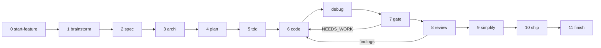

# mentis: the pipeline

> How a piece of work flows from an intention to a merged branch, which block owns each step,
> and what has to be true before a step is allowed to call itself done.
> Governance of *how blocks are written* is in `CONVENTIONS.md`; the registry of what exists is in
> `CATALOG.md`.

## 1. The pipeline

The steps are numbered because the order carries meaning, not because every task needs all of
them. A one-line fix doesn't get a brainstorm. What is **not** optional is the direction of travel:
you never review before the gate, and you never gate work you're still writing.

Two loops close backwards, and only these two: the gate returning `NEEDS_WORK`, and the review
producing findings. Both land back in `code`. Everything else moves forward.

| # | Step | Question it answers | Done when |
|---|---|---|---|
| 0 | `start-feature` | where does this work live? | an isolated worktree exists |
| 1 | `brainstorm` | do we understand the need? | the intent is stated, options weighed |
| 2 | `spec` | what does "working" mean? | verifiable acceptance criteria |
| 3 | `archi` | what already exists, and where does this plug in? | reuse vs create decided, no duplicate created |
| 4 | `plan` | in what order, in what slices? | verifiable steps |
| 5 | `tdd` | what will prove it works? | one contract line per criterion, all failing |
| 6 | `code` | the implementation | the scope's tests pass |
| — | `debug` | why doesn't it do what I think? | the cause is found, not guessed |
| 7 | `gate` | is "it works" a fact or a claim? | evidence read, fresh-context verdict `PASS` |
| 8 | `review` | is the diff good, and faithful to the spec? | findings triaged, verified, posted |
| 9 | `simplify` | what can go away? | net deletion where deletion was possible |
| 10 | `ship` | can this merge? | final gate green, MR ready for a human |
| 11 | `finish` | is the ground clean? | worktree cleaned, base branch updated |

## 2. Step → block mapping

The authoritative registry, with maturity per block, is `CATALOG.md` §1. This is the routing table.

| Step | Skill | Agents involved |
|---|---|---|
| 0 | `start-feature`, `portless-ready` (setup) | — |
| 1 | `brainstorm` | — |
| 2 | `spec` | — |
| 3 | `domain-modeling`, `archi`, `api-design`, `documentation-adr` | `architect` (periodic debt audit, outside the pipeline) |
| 4 | `plan`, `wayfinder` | — |
| 5 | `tdd`, `testing-anti-patterns` | `dozer` |
| 6 | `code` + the conventions block for the stack: `typescript-patterns`, `php-patterns`, `vue-nuxt-vuetify-conventions`, `react-nextjs-conventions`, `nestjs-node-conventions`, `go-conventions`, `dotnet-conventions`, `python-conventions`, `java-conventions`, `auth-session-conventions`, `security-hardening`, `background-jobs-conventions`, `webperf`, `seo`, `accessibility`, `observability-instrumentation`, `devops-conventions`, `data-pipeline-conventions` | `neo` (Vue/Nuxt), `morpheus` (Laravel), `trinity` (NestJS/Node), `tank` (SQL/ES) |
| — | `debug` | — |
| 7 | `gate` | `galadriel` |
| 8 | `review`, `qa-exploratory-testing` | `elrond` → `aragorn`/`gimli`/`legolas`/`boromir`/`theoden`/`frodo`; `mouse`, `seraph`, `keymaker`, `link` |
| 9 | `simplify`, `over-engineering-review` | — |
| 10 | `ship` | `gandalf` |
| 11 | `finish`, `merge-worktree` | — |
| cross-cutting | `deprecation-migration`, `handoff`, `choose-model`, `dispatch-parallel`, `extract-conventions`, `writing-skills`, `writing-agents`, `testing-blocks`, `distributing-blocks`, `using-mentis` | — |

## 3. The two guarantees that hold it together

Everything else in this repo is convenience. These two are the reason it works at all.

**Fresh context.** Whoever judges never watched the work being written. `galadriel` at the gate, the
per-stack reviewers at the review, `gandalf` at the ship. An agent that wrote the code has already
been convinced by its own reasoning; asking it to check itself buys a second opinion from the same
opinion. This is why builders (`neo`, `morpheus`, `trinity`, `dozer`) are structurally forbidden
from reviewing their own output, and why `dozer` may not touch implementation code at all.

**Default = failure.** Nothing is passing until evidence has been produced *and read*. No cited
evidence → `NEEDS_WORK`, not "probably fine". Corollaries that get skipped in practice: a red test
has to be red because the assertion failed, not because the file crashed; an unverifiable criterion
is reported "not verified", never counted as compliant; a finding without a source costs more
credibility than the bug it claimed to catch.

A third habit, weaker but real: **short output by default**. The pipeline generates a lot of
intermediate text and nobody reads walls of it. Report the conclusion and the evidence, not the
journey.

## 4. How responsibilities are split

One block = **one responsibility**. The rule exists because of a specific failure: a block that both
produces and judges will always find its own work acceptable. So the splits below aren't
organisational tidiness, each one is load-bearing.

- **Write vs review.** A builder writes; a reviewer reads. Never the same block, never the same
  context. Enforced by the agent naming families (`CONVENTIONS.md`): a Lord of the Rings name only
  watches, a Matrix name takes part in the dev cycle.
- **Write tests vs write implementation.** Split for the same reason, one level down: an agent that
  can do both will adjust the code until its test passes, and the suite stops meaning anything.
- **Gate vs review.** The gate (7) asks "is this claim backed by evidence?". The review (8) asks "is
  this code good?". Different questions, different failure modes, and merging them means the easier
  one wins.
- **Audit vs pipeline.** `architect`, `seraph`, `keymaker`, `link` run on demand over a whole repo or
  a live site, not inside a feature's flow. Wiring them into every task would make them noise, and
  noise gets ignored.
- **Skill vs command.** A command is a thin step trigger; the logic lives in the skill. One
  mechanism, one home.
- **Propose vs ratify.** Anything with consequences outside the worktree — a destructive migration, a
  shared-environment change, a breaking contract, a merge — is proposed by an agent and ratified by a
  human. No agent merges its own work.

When a block starts needing "and also", that's the signal to split it, not to grow it.

## 5. Checkpoints

Each step writes a checkpoint so a session that dies can be resumed without re-deriving what was
already settled: `spec_done`, `arch_done`, `tests_written`, `verified`, `reviewed`, and finally the
task closed at `finish`. A checkpoint records **what was proven**, not what was attempted. See
`handoff` for passing work between two sessions without duplicating the trail.
