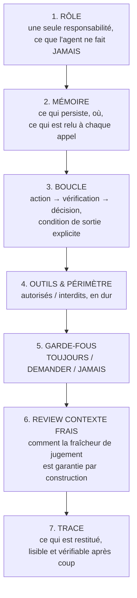
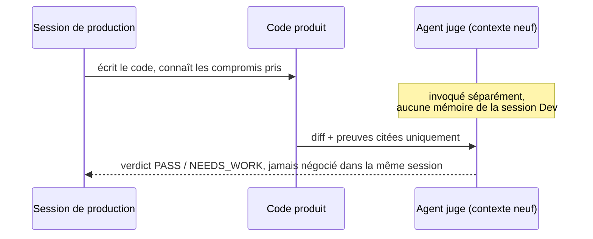
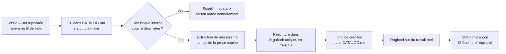

# Comment j'écris et je gouverne mes agents

> Ce doc explique la méthode, pas juste le résultat : pourquoi ce framework
> a cette forme, comment un agent naît chez moi, et les règles qui
> s'appliquent à tous, sans exception. Écrit pour quelqu'un qui ne connaît
> aucun de mes agents.

## 1. Le contexte

Ça fait à peu près un mois que je travaille là-dessus, construit de façon
itérative : pas de big-bang, un agent à la fois, chacun testé sur du
travail réel avant que je le considère comme acquis. Certains ont un vécu
de production réel (les reviewers Nuxt/Vue et PHP/Laravel, le gate final,
le juge à froid), d'autres sont écrits mais pas encore éprouvés sur du réel
(les agents Go/.NET, faute de projet sur ces stacks pour l'instant) — voir
[Statut réel](#8-statut-réel-honnêteté-sur-la-maturité).

Ma méthode : j'assemble le pipeline complet d'abord, sur une vraie tâche de
bout en bout, avant de figer un découpage en projets séparés. Je ne fige
aucune frontière tant que le tour complet n'a pas tourné une fois.

## 2. Le problème que je résous

Un agent générique type "assistant de code" me pose trois problèmes
concrets :

1. **Celui qui écrit le code ne peut pas être celui qui le juge**, dans la
   même session — il a vu le code s'écrire, il connaît les compromis pris
   en cours de route, il est structurellement complaisant avec lui-même.
2. **"Fais de ton mieux" n'est pas vérifiable.** Sans critère testable, un
   agent qui affirme "c'est fini, ça marche", je ne peux ni le confirmer
   ni le contredire. Il me faut une preuve citée (fichier, ligne, sortie de
   test), jamais une déclaration prise pour argent comptant.
3. **Je m'inspire du marché sans en dépendre.** De bonnes idées existent
   dans des repos publics — conventions, patrons d'agents, structures de
   frameworks. Mais les installer comme dépendance, c'est s'exposer à ce
   qu'un tiers change son comportement du jour au lendemain et casse
   silencieusement mon pipeline.

Trois règles répondent à ces trois problèmes.

## 3. Les trois règles fondatrices

### Règle A — je teste l'approche complète d'abord
J'assemble le pipeline entier (brainstorm → ... → finish) et je le fais
tourner sur une vraie tâche avant de découper en projets séparés. Le
découpage vient après, une fois que l'approche a fait ses preuves sur le
terrain.

### Règle B — je réécris à ma sauce, jamais je ne dépends
Toute idée venue de l'extérieur (skill, agent, technique), je la réécris en
interne, jamais branchée en dépendance runtime. Je lis la source, j'extrais
le mécanisme (pas la prose), je le réécris dans mon gabarit, et je crédite
l'origine honnêtement dans `CATALOG.md`. Ce que je garde, c'est l'idée —
jamais le paquet.

Pourquoi je procède comme ça : personne en amont ne peut casser mon
workflow ; je sais exactement ce que fait chaque brique, c'est mon code,
mes mots ; et tout est écrit de la même façon, donc n'importe qui connaît
le gabarit peut s'y retrouver.

### Règle C — le framework reste publiable
Je l'écris dès le départ pour pouvoir l'extraire un jour dans un repo
public : aucun secret, aucun nom de projet réel, aucune réalité d'infra
dans ce dossier. Une brique nomme un rôle ("le back Laravel"), jamais un
projet précis. Ma règle simple : si une phrase ne pourrait pas être lue par
quelqu'un d'extérieur, elle ne va pas ici.

## 4. Le gabarit unique — comment j'écris un agent

Tous mes agents suivent la même structure en 7 sections, jamais improvisée
au cas par cas :

Chaque section répond à une question précise :

| Section | Question à laquelle elle répond |
|---|---|
| RÔLE | Quelle est la seule responsabilité de cet agent, et que ne fait-il jamais ? |
| MÉMOIRE | Qu'est-ce qui persiste entre deux invocations, et où ça vit ? |
| BOUCLE | Quel est le cycle exact (action/vérification/décision), et comment ça s'arrête ? |
| OUTILS & PÉRIMÈTRE | Quels outils sont autorisés, lesquels sont interdits — en dur, pas juste à l'oral |
| GARDE-FOUS | Ce qui doit arriver toujours, ce que je demande plutôt que deviner, ce que je m'interdis |
| REVIEW CONTEXTE FRAIS | Comment je garantis que le jugement n'est pas pollué par la session qui a produit le travail |
| TRACE | Ce que l'agent restitue à la fin, pour que quelqu'un d'autre puisse vérifier après coup |

**Exemple concret** — mon agent `arbitre` (le juge à froid) :
- RÔLE : rendre un verdict binaire PASS/NEEDS_WORK, rien d'autre — pas de
  correction, pas de suggestion de code.
- MÉMOIRE : rien ne persiste entre deux invocations ; l'entrée doit
  contenir explicitement le diff, les critères d'acceptation, et les
  preuves.
- GARDE-FOUS (TOUJOURS) : preuve absente ou non concluante → `NEEDS_WORK`
  automatique, jamais de bénéfice du doute.

## 5. Les deux garanties transversales

### Contexte frais
Celui qui juge n'a jamais vu le code s'écrire :

Cette séparation n'est pas une option que j'active parfois : elle est
structurelle. L'agent juge est invoqué comme un sous-agent à part, sans
accès à l'historique de la conversation qui a produit le travail.

### Défaut = échec
Une affirmation ("j'ai testé, ça marche") sans preuve citée n'est pas une
preuve — je l'ignore. Si le périmètre donné est trop incomplet pour évaluer
quoi que ce soit, le verdict par défaut est `NEEDS_WORK`, jamais `PASS` par
optimisme. Cette règle-là, aucune des sources publiques que j'ai consultées
sur la conception d'agents ne la couvre — c'est la partie que j'ai dû
inventer moi-même plutôt que reprendre du marché.

### Sortie courte par défaut
Une réponse d'agent ne se facture pas comme une réponse humaine : chaque
mot de sortie a un coût réel en tokens. Par défaut, un agent restitue le
strict nécessaire — un statut, un verdict, une liste de findings fichier +
ligne + une phrase — jamais un pavé de justification ou de contexte
redondant avec ce que je peux déjà voir. Le détail (raisonnement complet,
alternatives explorées) reste disponible si je le redemande, il n'est pas
donné par défaut. J'ai exploré une piste dans le sourcing (agent "Caveman",
compression de sortie) : le style entièrement télégraphique, je l'ai
écarté (illisible à la relecture), mais le principe — sortie courte par
défaut plutôt que verbeuse — je le garde comme garantie transversale, au
même titre que le contexte frais et le défaut-échec.

## 6. TOUJOURS / DEMANDER / JAMAIS

Le format de garde-fous le plus robuste que j'ai trouvé dans la recherche
externe (analyse de plus de 2500 fichiers de configuration d'agents
publics) : une règle en trois tiers plutôt qu'une liste plate d'interdits.

- **TOUJOURS** : ce qui doit arriver systématiquement, sans exception.
- **DEMANDER** (jamais deviner) : les cas où l'agent doit s'arrêter et me
  demander plutôt que de choisir à ma place.
- **JAMAIS** : les lignes rouges absolues.

Exemple réel (mon agent `elrond`, l'orchestrateur qui détecte le stack d'un
diff et route vers le bon reviewer) : en cas d'ambiguïté de stack (monorepo,
signatures contradictoires), la règle n'est pas "fais de ton mieux" mais
explicitement DEMANDER — jamais deviner, quitte à interrompre le flux.

## 7. Comment un agent naît chez moi — le cycle de sourcing

Je n'adopte rien "parce que c'est dans un repo populaire" : chaque ligne du
`CATALOG.md` porte une décision explicite de ma part (adoptée ou écartée)
avec sa raison. Une bonne partie du backlog, je l'écarte volontairement —
c'est la preuve que le tri est réel, pas un empilement.

## 8. Statut réel, honnêteté sur la maturité

Pas de survente : certains de mes agents ont un vécu de production réel,
d'autres sont écrits mais pas encore confrontés à un vrai projet. Ce
tableau est tenu à jour dans `CATALOG.md` — la colonne maturité (✅ / 🟡 /
🔜) est la source de vérité, pas ce document.

## 9. Loop possible, mais pas sur tout

Mon pipeline peut tourner en boucle sans supervision jusqu'au gate :
brainstorm → spec → archi → plan → code → debug peuvent s'enchaîner sans
qu'un humain valide chaque étape. En revanche, deux points restent des
arrêts humains volontaires, non négociables :

- **Le gate** (`arbitre`) rend un verdict, mais ne merge rien.
- **Le merge lui-même** : 2 approbations humaines avant merge, toujours.

Ce n'est pas une limitation technique — l'autonomie bout-en-bout façon des
frameworks d'autonomie agentique totale du marché, je l'ai explicitement
écartée comme repoussoir dans le sourcing (`CATALOG.md`) : un agent qui
merge du code tout seul sans validation est exactement le contre-exemple
que je ne veux pas devenir. La boucle accélère la production, jamais la
décision de merger.

## 10. La vision — que le système apprenne, pas juste qu'il tourne

Mon objectif n'est pas un set d'agents figé : c'est un système qui devient
plus intelligent avec l'usage, sans jamais changer les règles fixes
(contexte frais, défaut=échec). Ce qui s'améliore, c'est la connaissance
métier accumulée — pas la doctrine. J'ai déjà trois boucles de retour,
partiellement en place :

- **Calibration** : chaque review réelle (findings retenus, faux positifs
  infirmés) est journalisée, pour que le tri futur reconnaisse plus vite ce
  qui vaut la peine d'être remonté.
- **Mémoire persistante** : mes corrections et confirmations sur une
  approche deviennent des règles durables, relues avant d'agir à nouveau —
  pas ré-expliquées à chaque fois.
- **`extract-conventions`** : génère des conventions depuis le code réel
  existant plutôt que depuis une doctrine abstraite, donc se met à jour
  avec le code lui-même.

Ce qui me manque encore pour que ce soit systématique plutôt qu'au fil de
l'eau : une revue périodique qui relit ces trois sources et met à jour
`CATALOG.md` (maturité, garde-fous affinés) — pas encore automatisée, à
poser comme prochaine étape.

## 11. Pourquoi ça compte

- **La review ne complaît pas** : parce que le reviewer n'est jamais celui
  qui a écrit le code, dans une session séparée à froid.
- **Rien n'est cru sur parole** : "c'est fini" n'est jamais suffisant, une
  preuve concrète l'est.
- **Ça s'enrichit sans dépendre** : le marché évolue, je pioche dedans, mais
  rien ne peut casser mon pipeline en changeant de l'extérieur.
- **Adapté à ma réalité, pas à une fiction de compétence uniforme** : un
  agent formule ses remarques en questions honnêtes sur un stack que je ne
  maîtrise pas encore (PHP/Laravel), et en affirmations tranchées sur un
  stack où j'ai une vraie expertise (JS/TS) — le style suit ma réalité, pas
  un ton générique.
