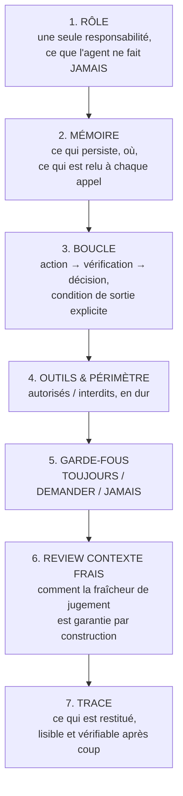
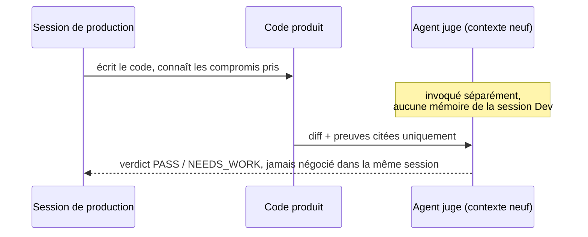
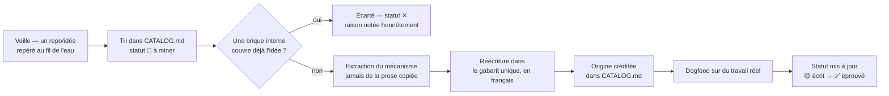

# Comment on écrit et on gouverne nos agents

> Ce document explique la méthode, pas juste le résultat : pourquoi ce
> framework a cette forme, comment un agent naît, et quelles règles
> s'appliquent à tous, sans exception. Écrit pour être lu par quelqu'un qui
> ne connaît aucun de nos agents.

## 1. Le contexte

Ce travail est en cours depuis environ un mois, construit de façon
itérative : pas un big-bang, un agent à la fois, chacun testé sur du travail
réel avant d'être considéré comme acquis. Certains ont un vécu de production
réel (les reviewers Nuxt/Vue et PHP/Laravel, le gate final, le juge à froid),
d'autres sont écrits mais pas encore éprouvés sur du réel (les agents
Go/.NET, faute de projet sur ces stacks à ce jour) — voir [Statut réel](#8-statut-réel-honnêteté-sur-la-maturité).

La démarche suivie : **assembler le pipeline complet d'abord**, sur une
vraie tâche de bout en bout, **avant** de figer un découpage en projets
séparés. On ne fige aucune frontière tant que le tour complet n'a pas
tourné une fois.

## 2. Le problème qu'on résout

Un agent générique type "assistant de code" pose trois problèmes concrets :

1. **Celui qui écrit le code ne peut pas être celui qui le juge**, dans la
   même session — il a vu le code s'écrire, il connaît les compromis pris
   pendant l'écriture, il est structurellement complaisant avec lui-même.
2. **"Fais de ton mieux" n'est pas vérifiable.** Sans critère testable, un
   agent qui affirme "c'est fini, ça marche" ne peut être ni confirmé ni
   contredit — il faut une preuve citée (fichier, ligne, sortie de test),
   jamais une déclaration prise pour argent comptant.
3. **S'inspirer du marché sans en dépendre.** De bonnes idées existent dans
   des repos publics (conventions, patrons d'agents, structures de
   frameworks) — mais les installer comme dépendance expose à ce qu'un tiers
   change son comportement du jour au lendemain, ou casse silencieusement
   notre pipeline.

Trois règles fondatrices répondent à ces trois problèmes.

## 3. Les trois règles fondatrices

### Règle A — tester l'approche complète d'abord
On assemble le pipeline entier (brainstorm → ... → finish) et on le fait
tourner sur une vraie tâche avant de découper en projets séparés. Le
découpage vient après, une fois l'approche validée sur le terrain.

### Règle B — réécrire "à notre sauce", jamais dépendre
Toute idée venue de l'extérieur (skill, agent, technique) est **réécrite en
interne**, jamais branchée en dépendance runtime. On lit la source, on
extrait le *mécanisme* (pas la prose), on le réécrit dans notre gabarit, et
on **crédite l'origine honnêtement** dans `CATALOG.md`. Ce qu'on garde,
c'est l'idée — jamais le paquet.

Pourquoi : personne en amont ne peut modifier ou casser notre workflow ; on
sait exactement ce que fait chaque brique, c'est notre code, nos mots ; et
tout est écrit de la même façon, donc maintenable par n'importe qui qui
connaît le gabarit.

### Règle C — le framework reste publiable
Écrit dès le départ pour pouvoir être extrait un jour dans un repo public :
aucun secret, aucun nom de projet réel, aucune réalité d'infra dans ce
dossier. Une brique nomme un rôle ("le back Laravel"), jamais un projet
précis. Règle simple : si une phrase ne pourrait pas être lue par quelqu'un
d'extérieur, elle ne va pas ici.

## 4. Le gabarit unique — comment un agent est écrit

Tous les agents suivent la **même structure en 7 sections**, jamais
improvisée au cas par cas :

Chaque section répond à une question précise :

| Section | Question à laquelle elle répond |
|---|---|
| RÔLE | Quelle est la seule responsabilité de cet agent, et que ne fait-il jamais ? |
| MÉMOIRE | Qu'est-ce qui persiste entre deux invocations, et où ça vit ? |
| BOUCLE | Quel est le cycle exact (action/vérification/décision), et comment ça s'arrête ? |
| OUTILS & PÉRIMÈTRE | Quels outils sont autorisés, lesquels sont interdits — en dur, pas juste à l'oral |
| GARDE-FOUS | Qu'est-ce qu'on fait toujours, ce qu'on demande plutôt que deviner, ce qu'on ne fait jamais |
| REVIEW CONTEXTE FRAIS | Comment on garantit que le jugement n'est pas pollué par la session qui a produit le travail |
| TRACE | Ce que l'agent restitue à la fin, pour que quelqu'un d'autre puisse vérifier après coup |

**Exemple concret** — l'agent `arbitre` (le juge à froid) :
- RÔLE : rendre un verdict binaire PASS/NEEDS_WORK, rien d'autre — pas de
  correction, pas de suggestion de code.
- MÉMOIRE : rien ne persiste entre deux invocations ; l'entrée doit contenir
  explicitement le diff, les critères d'acceptation, et les preuves.
- GARDE-FOUS (TOUJOURS) : preuve absente ou non concluante → `NEEDS_WORK`
  automatique, jamais de bénéfice du doute.

## 5. Les deux garanties transversales

### Contexte frais
Celui qui juge n'a jamais vu le code s'écrire :

Cette séparation n'est pas une option qu'on active parfois : elle est
**structurelle**. L'agent juge est invoqué comme un sous-agent à part, sans
accès à l'historique de la conversation qui a produit le travail.

### Défaut = échec
Une affirmation ("j'ai testé, ça marche") sans preuve citée n'est pas une
preuve — elle est ignorée. Si le périmètre donné est incomplet au point de
ne rien pouvoir évaluer, le verdict par défaut est `NEEDS_WORK`, jamais
`PASS` par optimisme. **Cette règle n'est couverte par aucune des sources
publiques consultées sur la conception d'agents** — c'est la partie qu'on a
dû inventer nous-mêmes plutôt que reprendre du marché.

### Sortie courte par défaut
Une réponse d'agent n'est pas facturée pareil qu'une réponse humaine : chaque
mot de sortie a un coût réel en tokens. Par défaut, un agent restitue le
strict nécessaire — un statut, un verdict, une liste de findings fichier +
ligne + une phrase — jamais un pavé de justification ou de contexte redondant
avec ce que le lecteur peut déjà voir. Le détail (raisonnement complet,
alternatives explorées) reste disponible si redemandé, il n'est pas donné par
défaut. Piste explorée dans le sourcing (agent "Caveman", compression de
sortie) : le style **entièrement** télégraphique a été écarté (illisible à la
relecture), mais le principe — sortie courte par défaut plutôt que verbeuse —
est retenu comme garantie transversale au même titre que le contexte frais et
le défaut-échec.

## 6. TOUJOURS / DEMANDER / JAMAIS

Le format de garde-fous le plus robuste identifié dans la recherche externe
(analyse de plus de 2500 fichiers de configuration d'agents publics) : une
règle en trois tiers plutôt qu'une liste plate d'interdits.

- **TOUJOURS** : ce qui doit arriver systématiquement, sans exception.
- **DEMANDER** (jamais deviner) : les cas où l'agent doit s'arrêter et
  demander plutôt que de choisir à sa place.
- **JAMAIS** : les lignes rouges absolues.

Exemple réel (agent `elrond`, l'orchestrateur qui détecte le stack d'un
diff et route vers le bon reviewer) : en cas d'ambiguïté de stack (monorepo,
signatures contradictoires), la règle n'est pas "fais de ton mieux" mais
explicitement **DEMANDER** — ne jamais deviner, quitte à interrompre le flux.

## 7. Comment un agent naît — le cycle de sourcing

Rien n'est adopté "parce que c'est dans un repo populaire" : chaque ligne du
`CATALOG.md` porte une décision explicite (adoptée ou écartée) avec sa
raison. Une bonne partie du backlog est volontairement écartée — c'est une
preuve que le tri est réel, pas un empilement.

## 8. Statut réel, honnêteté sur la maturité

Pas de survente : certains agents ont un vécu de production réel, d'autres
sont écrits mais pas encore confrontés à un vrai projet. Ce tableau est
tenu à jour dans `CATALOG.md` — la colonne maturité (✅ / 🟡 / 🔜) est la
source de vérité, pas ce document.

## 9. Loop possible, mais pas sur tout

Le pipeline peut tourner en boucle sans supervision **jusqu'au gate** :
brainstorm → spec → archi → plan → code → debug peuvent s'enchaîner sans
qu'un humain valide chaque étape. En revanche, deux points restent des
arrêts humains volontaires, non négociables :

- **Le gate** (`arbitre`) rend un verdict, mais ne merge rien.
- **Le merge lui-même** : 2 approbations humaines avant merge, toujours.

Ce n'est pas une limitation technique — l'autonomie bout-en-bout façon
`LobeHub`/`OpenHands` a été explicitement écartée comme repoussoir dans le
sourcing (`CATALOG.md`) : un agent qui fusionne du code tout seul sans
validation est le contre-exemple qu'on ne veut pas devenir. La boucle
accélère la production, jamais la décision de merger.

## 10. Pourquoi ça compte

- **La review ne complaît pas** : parce que le reviewer n'est jamais celui
  qui a écrit le code, dans une session séparée à froid.
- **Rien n'est cru sur parole** : "c'est fini" n'est jamais suffisant, une
  preuve concrète l'est.
- **Ça s'enrichit sans dépendre** : le marché évolue, on pioche dedans, mais
  rien ne peut casser notre pipeline en changeant de l'extérieur.
- **Adapté à la réalité, pas à une fiction de compétence uniforme** : un
  agent formule ses remarques en questions honnêtes sur un stack que
  l'auteur ne maîtrise pas encore (PHP/Laravel), et en affirmations
  tranchées sur un stack où il a une vraie expertise (JS/TS) — le style
  suit la réalité, pas un ton générique.
