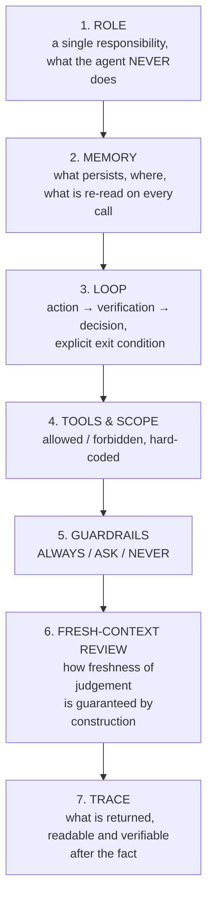
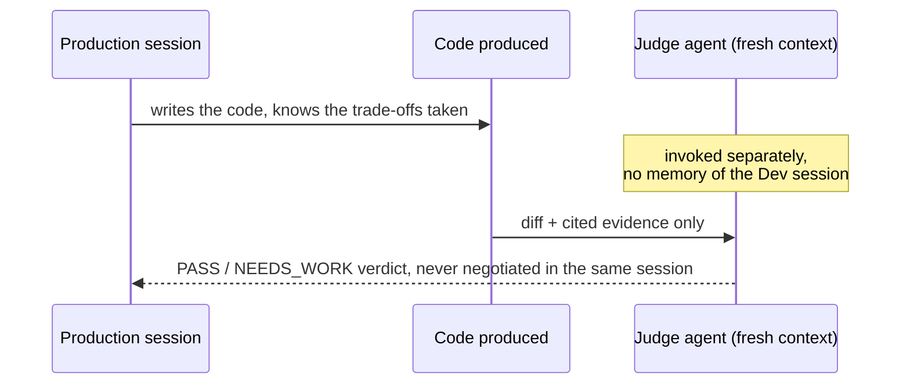
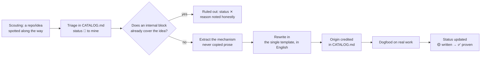

# How I write and govern my agents

This doc explains the method, not just the result: why this framework has
this shape, how an agent is born here, and the rules that apply to all of
them, without exception. Written for someone who knows none of my agents.

## 1. The context

I've been working on this for about a month. Built piece by piece, not in one
go: one agent at a time, each tested on real work before I consider it
settled. Some already have real production experience (the Nuxt/Vue and
PHP/Laravel reviewers, the final gate, the cold judge). Others are written
but not yet proven on anything real, for lack of a project on those stacks
for now (the Go/.NET agents). The detail is in the
[Real status](#8-real-status-being-honest-about-maturity) section.

My baseline method: I assemble the complete pipeline first, on a real task
end to end, before freezing a split into separate projects. I freeze no
boundary until the full loop has run once.

## 2. The problem I'm solving

A generic "code assistant" agent gives me three concrete problems.

The first: whoever writes the code cannot be the one who judges it, in the
same session. It watched the code being written, it knows the trade-offs
taken along the way, it is structurally lenient with itself.

The second: "do your best" is not verifiable. Without a testable criterion,
an agent that claims "it's done, it works" is something I can neither
confirm nor contradict. I need cited evidence (file, line, test output),
never a statement taken at face value.

The third: I take inspiration from the market without depending on it. Good
ideas exist in public repos, conventions, agent patterns, framework
structures. But installing them as a dependency means exposing myself to a
third party changing its behaviour overnight and breaking my pipeline
without warning.

Three rules answer those three problems.

## 3. The three founding rules

### Rule A: I test the complete approach first
I assemble the whole pipeline (brainstorm → ... → finish) and run it on a
real task before splitting it into separate projects. The split comes
afterwards, once the approach has proven itself in the field.

### Rule B: I rewrite it my way, I never depend on it
Any idea coming from outside (skill, agent, technique) gets rewritten
internally. Never wired in as a runtime dependency. I read the source, I
extract the mechanism (not the prose), I rewrite it in my template, and I
credit the origin honestly in `CATALOG.md`. What I keep is the idea, never
the package.

Why I work that way: nobody upstream can break my workflow. I know exactly
what each block does, it's my code, my words. And everything is written the
same way, so anyone who knows the template can find their way around.

### Rule C: the framework stays publishable
I write it from the start so it can be extracted one day into a public repo:
no secrets, no real project names, no infra reality in this folder. A block
names a role ("the Laravel backend"), never a specific project. My simple
rule: if a sentence couldn't be read by someone from outside, it doesn't go
here.

## 4. The single template: how I write an agent

All my agents follow the same 7-section structure, never improvised case by
case.

ROLE is what this agent's single responsibility is, and what it never does.
MEMORY is what persists between two invocations and where it lives. LOOP is
the exact cycle, action then verification then decision, and how it stops.
TOOLS & SCOPE lists what is allowed and what is forbidden, hard-coded, not
just verbally. GUARDRAILS is what must always happen, what I want asked
rather than guessed, what is off limits. FRESH-CONTEXT REVIEW explains how I
guarantee that judgement isn't polluted by the session that produced the
work. TRACE, finally, is what the agent returns at the end, so that someone
else can verify it after the fact.

One exception, added on 2026-08-14, and it is the same rule pushed one step
further. When several agents do the same job on different stacks, those seven
sections end up identical, and identical text in eight files stops being
identical the first time one of them is fixed. My eight review readers had
drifted to 93 to 96 percent similar for 92 KB. So a **uniform family may hoist
sections 1 to 7 into a single `references/` doc**: their contract now lives in
`references/review-core.md`, each reader reads it first, and its own file
carries only what actually differs, its calibration, its scope, its default
mode, where its rules come from, what it looks for, its style delta. The
contract isn't weaker, it's written once, which is the only way it stays
identical. Any agent outside such a family still carries all seven itself.

A concrete example, my `galadriel` agent (the cold judge). Its role: return a
binary PASS/NEEDS_WORK verdict, nothing else, no fixes, no code
suggestions. Its memory: nothing persists between two invocations, the input
must explicitly contain the diff, the acceptance criteria and the evidence.
Its main guardrail: missing or inconclusive evidence means automatic
`NEEDS_WORK`, never the benefit of the doubt.

## 5. The two cross-cutting guarantees

### Fresh context
Whoever judges never watched the code being written.

This isn't an option I switch on now and then, it's structural. The judge
agent is invoked as a separate subagent, with no access to the history of
the conversation that produced the work.

### Default = failure
A claim along the lines of "I tested it, it works" without cited evidence is
not evidence, I ignore it. If the scope given is too incomplete to assess
anything, the default verdict is `NEEDS_WORK`, never `PASS` out of optimism.
I found this rule in none of the public sources I consulted on agent design.
It's the part I had to invent myself.

### Short output by default
An agent's answer isn't billed like a human's answer, every output word has a
real token cost. By default, an agent returns the bare minimum: a status, a
verdict, a list of findings with file + line + one sentence. Never a wall of
justification or context that duplicates what I can already see. The detail
(full reasoning, alternatives explored) stays available if I ask for it
again, it isn't given by default. I had explored a lead while sourcing, a
"Caveman" agent in output-compression mode. The fully telegraphic style I
ruled out, unreadable on a second pass. But the principle, short output by
default rather than verbose, I keep as a cross-cutting guarantee, on the same
footing as fresh context and default-failure.

Until 2026-08-14 that guarantee was stated and enforced nowhere, so a review
that found four things still came back as two pages. It now has a mechanism,
`references/terse-reporting.md`, cited from the TRACE section of the seventeen
agents that hand back a report and from `review-core.md`: verdict on the first
line, one line per item with file, fact and consequence, then the artefact
paths, and an explicit list of what never appears, preamble, restatement of my
own instruction, method narrative, count of files read.

Three things are exempt, and they are where a terse register actually breaks,
not on length. **Negation and polarity**, because "nothing found on the parsing
path" compressed to "parsing" inverts a verdict, and a gate reporting the
opposite of what it found is worse than a gate saying nothing. **The verdict
word itself**, spelled out, not an emoji or a colour. **The confidence level**,
because flattening confirmed, worth-digging-into and speculative into one list
is a loss, not a saving. And evidence stays quoted in full: under default =
failure a paraphrased proof is not a proof.

The boundary matters as much as the rule. This governs the **report**, what I
read once and act on. It never governs the **artefact**, what someone else
reads later, an MR comment, an ADR, a commit message. Those keep their own
register, which for an MR comment is already short and direct for a different
reason, it has to pass as written by me in a public thread.

## 6. ALWAYS / ASK / NEVER

The most robust guardrail format I found in external research (analysing more
than 2,500 public agent configuration files) is a three-tier rule rather than
a flat list of prohibitions: ALWAYS for what must happen systematically, ASK
for the cases where the agent must stop and ask me rather than choose on my
behalf, NEVER for the absolute red lines.

A real example with `elrond`, my orchestrator that detects a diff's stack and
routes it to the right reviewer. When the stack is ambiguous (monorepo,
contradictory signatures), the rule isn't "do your best" but explicitly ASK.
Never guess, even at the cost of interrupting the flow.

## 7. How an agent is born here: the sourcing cycle

I adopt nothing because it sits in a popular repo. Every line of
`CATALOG.md` carries an explicit decision of mine, adopted or ruled out, with
its reason noted. A good part of the backlog I deliberately rule out, and
that is precisely what proves the triage is real, not just a pile-up.

## 8. Real status, being honest about maturity

No overselling here. Some of my agents have real production experience,
others are written but not yet confronted with a real project. The table is
kept up to date in `CATALOG.md`, and its maturity column is the source of
truth, not this document. One distinction matters there: **🟢 means it ran on
real work; ✅ only means the rewrite is finished.** Most of the repo is 🟡 —
written, never run — and saying so is the point of the column.

Two consequences of the same honesty:

- **A second layer exists with a weaker contract.** The `business/` blocks
  (legal, marketing, sales, communication, product) are written *without*
  internal expertise in those functions, they never gate anything, and 🟡 is
  their ceiling until someone who owns that function reviews them. They live in
  a separate folder precisely so the dev core's claims aren't diluted by
  association — the reasoning is in `business/README.md`.
- **Where someone else already owns a rule, I don't.** The
  org skill catalogue (211 skills, versioned, installed org-wide)
  is the authority on per-stack style and structure. Two sources for one rule
  is the same failure as a producer judging its own work: nobody knows which
  holds. The boundary is drawn block by block in `CATALOG.md` §0.

## 9. A loop is possible, but not on everything

My pipeline can run in a loop without supervision up to the gate: brainstorm
→ spec → archi → plan → code → debug can chain together without a human
validating each step. Two points nevertheless remain deliberate human stops,
non-negotiable: the gate (`galadriel`) returns a verdict but merges nothing,
and the merge itself always requires 2 human approvals.

This isn't a technical limitation on my side. End-to-end autonomy in the
style of the market's fully agentic autonomy frameworks I explicitly ruled
out as a counter-example while sourcing (`CATALOG.md`): an agent that merges
code on its own without validation is exactly the counter-example I don't
want to become. The loop speeds up production, never the decision to merge.

## 10. The vision: the system should learn, not just run

My goal isn't to have a frozen set of agents. It's a system that gets smarter
with use, without ever touching the fixed rules (fresh context, default =
failure). What improves is the accumulated domain knowledge, not the
doctrine. I already have three feedback loops in place, even if only
partially.

Calibration first: every real review, findings kept or false positives
disproved, is logged, so that future triage recognises faster what is worth
raising. Then persistent memory: my corrections and confirmations on an
approach become durable rules, re-read before acting again, not re-explained
every time. And `extract-conventions`, which generates conventions from the
real existing code rather than from an abstract doctrine, so it updates
itself along with the code.

What I still lack for this to be systematic rather than ad hoc: a periodic
review that re-reads those three sources and updates `CATALOG.md` (maturity,
refined guardrails). Not automated yet, to be set up as the next step.

## 11. Why it matters

The review doesn't flatter, because the reviewer is never the one who wrote
the code, in a separate cold session. Nothing is taken on trust, "it's done"
is never enough, concrete evidence is. It grows richer without depending on
anything: the market evolves, I dip into it, but nothing can break my
pipeline by changing from the outside. And it's adapted to my reality, not to
a fiction of uniform competence: an agent phrases its remarks as honest
questions on a stack I haven't mastered yet (PHP/Laravel), and as clear-cut
statements on a stack where I have real expertise (JS/TS). The style follows
my reality, not a generic tone.
